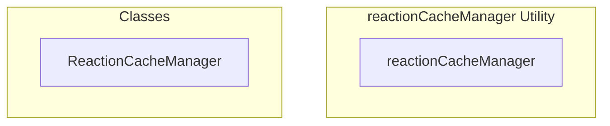

# reactionCacheManager Utility

**File:** `src/utils/reactionCacheManager.ts`

## Overview




## Exports

- **ReactionCacheManager** - class export
- **reactionCacheManager** - const export


## Classes

### ReactionCacheManager

No description available.

**Methods:**
- `clearOptimisticState`
- `clearAllCache`

**Properties:**
- `message`
- `data`
- `reactionsStore`


## Source Code Insights

**File Size:** 1140 characters
**Lines of Code:** 35
**Imports:** 2

## Usage Example

```typescript
import { ReactionCacheManager, reactionCacheManager } from '@/utils/reactionCacheManager'

// Example usage
// Use the exported functionality
```

---

*This documentation was automatically generated from the source code.*