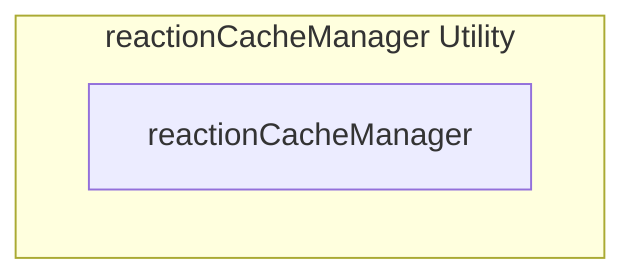

# reactionCacheManager Utility

**File:** `src/utils/reactionCacheManager.ts`

## Overview


```mermaid
graph TB
    subgraph "reactionCacheManager Utility"
        REACTIONCACHEMANAGER[ReactionCacheManager]
        REACTIONCACHEMANAGER[reactionCacheManager]
    end
    
    
    
    
```

## Exports

- **ReactionCacheManager** - No description
- **reactionCacheManager** - No description


## Classes

### ReactionCacheManager

No description available.

**Methods:**
- `startCleanup`
- `if`

**Properties:**
- `cleanupInterval`
- `null`
- `CLEANUP_INTERVAL`
- `cleanupInterval`
- `reactionsStore`


## Source Code Insights

**File Size:** 1209 characters
**Lines of Code:** 48
**Imports:** 1

## Usage Example

```typescript
import { ReactionCacheManager, reactionCacheManager } from '@/utils/reactionCacheManager.ts'

// Example usage
// Use the exported functionality
```

---

*This documentation was automatically generated from the source code.*