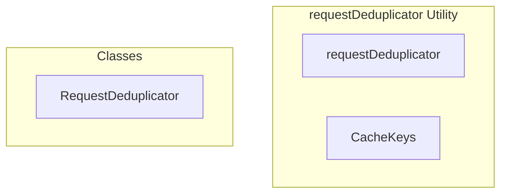

# requestDeduplicator Utility

**File:** `src/utils/requestDeduplicator.ts`

## Overview




## Exports

- **requestDeduplicator** - const export
- **CacheKeys** - const export


## Classes

### RequestDeduplicator

No description available.

**Methods:**
- `clearCache`
- `getStats`

**Properties:**
- `pendingRequests`
- `cache`
- `timestamp`
- `TTL`
- `defaultCacheTTL`
- `deduplication`
- `promise`
- `request`
- `options`
- `key`
- `fetcher`
- `cacheTTL`
- `forceRefresh`
- `cached`
- `pending`
- `enabled`
- `data`
- `result`
- `pattern`
- `keyOrPattern`
- `statistics`
- `cachedItems`


## Type Definitions

### PendingRequest

No description available.

```typescript
type PendingRequest<T> = {
  promise: Promise<T>
  timestamp: number
}

class RequestDeduplicator {
  private pendingRequests = new Map<string, PendingRequest<any>>()
  private cache = new Map<string, { data: any;
```


## Source Code Insights

**File Size:** 4226 characters
**Lines of Code:** 142
**Imports:** 1

## Usage Example

```typescript
import { requestDeduplicator, CacheKeys } from '@/utils/requestDeduplicator'

// Example usage
// Use the exported functionality
```

---

*This documentation was automatically generated from the source code.*