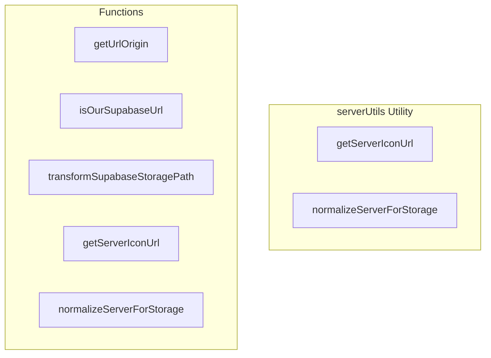

# serverUtils Utility

**File:** `src/utils/serverUtils.ts`

## Overview




## Exports

- **getServerIconUrl** - function export
- **normalizeServerForStorage** - function export

## Functions

### `getUrlOrigin(url: string)`

No description available.

**Parameters:**
- `url: string`

**Returns:** `string | null`

```typescript
/**
 * Get the origin (protocol + host) from a URL string
 */
function getUrlOrigin(url: string): string | null
```

### `isOurSupabaseUrl(url: string)`

No description available.

**Parameters:**
- `url: string`

**Returns:** `boolean`

```typescript
/**
 * Check if a URL is from our Supabase instance
 */
function isOurSupabaseUrl(url: string): boolean
```

### `transformSupabaseStoragePath(path: string, size: number)`

No description available.

**Parameters:**
- `path: string`
- `size: number`

**Returns:** `string`

```typescript
/**
 * Transform a Supabase storage path with size optimization
 */
function transformSupabaseStoragePath(path: string, size: number): string
```

### `getServerIconUrl(serverUrl: string | null | undefined, size: number = 96)`

No description available.

**Parameters:**
- `serverUrl: string | null | undefined`
- `size: number = 96`

**Returns:** `string`

```typescript
/**
 * Normalizes server URL to ensure consistent display across the application.
 * 
 * Handles:
 * - Blob URLs (preview images)
 * - Full HTTP/HTTPS URLs (external or Supabase storage)
 * - Supabase storage paths (relative paths)
 * - Local paths (starting with /)
 * 
 * For our Supabase storage URLs, applies size optimization.
 * For external URLs (including other Supabase instances), returns as-is.
 * 
 * @param serverUrl - The server icon URL (can be null, undefined, or various formats)
 * @param size - Desired icon size in pixels (default: 96)
 * @returns Normalized URL string, or default icon path if invalid
 */
export function getServerIconUrl(serverUrl: string | null | undefined, size: number = 96): string
```

### `normalizeServerForStorage(serverUrl: string | null | undefined)`

No description available.

**Parameters:**
- `serverUrl: string | null | undefined`

**Returns:** `string | null`

```typescript
/**
 * Normalizes server URL for storage in the database.
 * 
 * Ensures we store:
 * - Relative paths for our Supabase storage (not full URLs)
 * - Full URLs for external sources (federated servers)
 * - null for blob URLs (temporary previews)
 * 
 * @param serverUrl - The server icon URL to normalize
 * @returns Normalized URL string for storage, or null if invalid
 */
export function normalizeServerForStorage(serverUrl: string | null | undefined): string | null
```


## Constants

### DEFAULT_SERVER_ICON

No description available.

```typescript
const DEFAULT_SERVER_ICON = '/default_server.webp'
```

### SERVER_ICONS_BUCKET

No description available.

```typescript
const SERVER_ICONS_BUCKET = 'server_icons'
```

### SUPABASE_STORAGE_PATTERN

No description available.

```typescript
const SUPABASE_STORAGE_PATTERN = /\/storage\/v1\/object\/public\/server_icons\/(.+)$/
```

### TRANSFORM_OPTIONS

No description available.

```typescript
const TRANSFORM_OPTIONS = {
```


## Source Code Insights

**File Size:** 4423 characters
**Lines of Code:** 156
**Imports:** 1

## Usage Example

```typescript
import { getServerIconUrl, normalizeServerForStorage } from '@/utils/serverUtils'

// Example usage
getUrlOrigin()
```

---

*This documentation was automatically generated from the source code.*