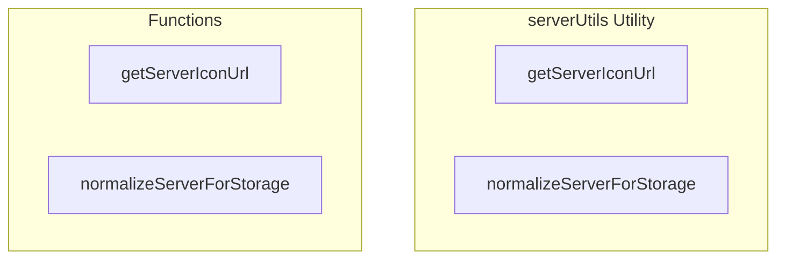

# serverUtils Utility

**File:** `src/utils/serverUtils.ts`

## Overview


```mermaid
graph TB
    subgraph "serverUtils Utility"
        GETSERVERICONURL[getServerIconUrl]
        NORMALIZESERVERFORSTORAGE[normalizeServerForStorage]
    end
    
    subgraph "Functions"
        FN_GETSERVERICONURL[getServerIconUrl]
        FN_NORMALIZESERVERFORSTORAGE[normalizeServerForStorage]
    end
```


## Exports

- **getServerIconUrl** - function export
- **normalizeServerForStorage** - function export

## Functions

### `getServerIconUrl(serverUrl: string | null | undefined)`

No description available.

**Parameters:**
- `serverUrl: string | null | undefined`

**Returns:** `string`

```typescript
/**
 * Normalizes server URL to ensure consistent display across the application
 * Handles both full URLs and path-only formats
 * Always returns the proper public URL for Supabase storage paths
 */
export function getServerIconUrl(serverUrl: string | null | undefined): string
```

### `normalizeServerForStorage(serverUrl: string | null | undefined)`

No description available.

**Parameters:**
- `serverUrl: string | null | undefined`

**Returns:** `string | null`

```typescript
/**
 * Normalizes server URL for storage - ensures we store paths, not full URLs
 * This should be used before saving server URLs to the database
 */
export function normalizeServerForStorage(serverUrl: string | null | undefined): string | null
```


## Source Code Insights

**File Size:** 2386 characters
**Lines of Code:** 72
**Imports:** 1

## Usage Example

```typescript
import { getServerIconUrl, normalizeServerForStorage } from '@/utils/serverUtils'

// Example usage
getServerIconUrl()
```

---

*This documentation was automatically generated from the source code.*