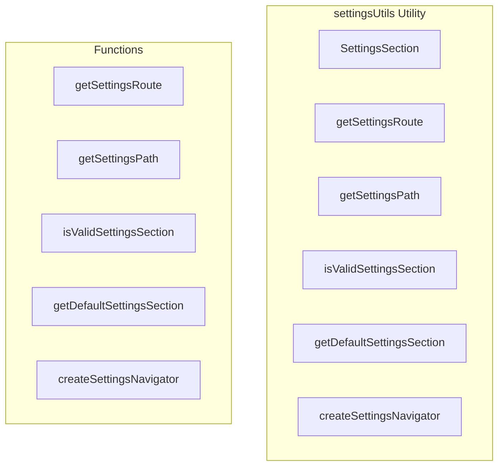

# settingsUtils Utility

**File:** `src/utils/settingsUtils.ts`

## Overview




## Exports

- **SettingsSection** - type export
- **getSettingsRoute** - function export
- **getSettingsPath** - function export
- **isValidSettingsSection** - function export
- **getDefaultSettingsSection** - function export
- **createSettingsNavigator** - function export

## Functions

### `getSettingsRoute(section: SettingsSection)`

No description available.

**Parameters:**
- `section: SettingsSection`

**Returns:** `RouteLocationRaw`

```typescript
/**
 * Utility functions for settings navigation and URL handling
 */

import type { RouteLocationRaw } from 'vue-router'

export type SettingsSection = 
  | 'account' 
  | 'privacy' 
  | 'appearance' 
  | 'notifications' 
  | 'activitypub'
  | 'voice' 
  | 'keybinds' 
  | 'language' 
  | 'advanced'

/**
 * Generates a settings route for the given section
 */
export function getSettingsRoute(section: SettingsSection): RouteLocationRaw
```

### `getSettingsPath(section: SettingsSection)`

No description available.

**Parameters:**
- `section: SettingsSection`

**Returns:** `string`

```typescript
/**
 * Generates a settings URL path for the given section
 */
export function getSettingsPath(section: SettingsSection): string
```

### `isValidSettingsSection(section: string)`

No description available.

**Parameters:**
- `section: string`

**Returns:** `section is SettingsSection`

```typescript
/**
 * Validates if a section name is valid
 */
export function isValidSettingsSection(section: string): section is SettingsSection
```

### `getDefaultSettingsSection()`

No description available.

**Parameters:**
None

**Returns:** `SettingsSection`

```typescript
/**
 * Gets the default settings section
 */
export function getDefaultSettingsSection(): SettingsSection
```

### `createSettingsNavigator(router: any)`

No description available.

**Parameters:**
- `router: any`

**Returns:** `void`

```typescript
/**
 * Creates a programmatic navigation helper for settings
 */
export function createSettingsNavigator(router: any)
```


## Source Code Insights

**File Size:** 2038 characters
**Lines of Code:** 90
**Imports:** 1

## Usage Example

```typescript
import { SettingsSection, getSettingsRoute, getSettingsPath, isValidSettingsSection, getDefaultSettingsSection, createSettingsNavigator } from '@/utils/settingsUtils'

// Example usage
getSettingsRoute()
```

---

*This documentation was automatically generated from the source code.*