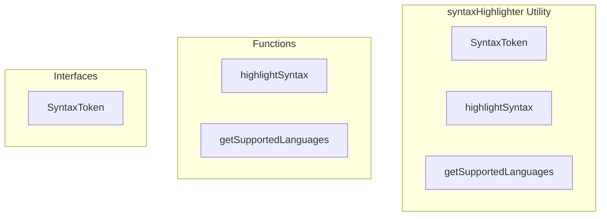

# syntaxHighlighter Utility

**File:** `src/utils/syntaxHighlighter.ts`

## Overview




## Exports

- **SyntaxToken** - interface export
- **highlightSyntax** - function export
- **getSupportedLanguages** - function export

## Functions

### `highlightSyntax(code: string, language: string = 'text')`

No description available.

**Parameters:**
- `code: string`
- `language: string = 'text'`

**Returns:** `SyntaxToken[]`

```typescript
export function highlightSyntax(code: string, language: string = 'text'): SyntaxToken[]
```

### `getSupportedLanguages()`

No description available.

**Parameters:**
None

**Returns:** `string[]`

```typescript
export function getSupportedLanguages(): string[]
```


## Interfaces

### SyntaxToken

No description available.

```typescript
interface SyntaxToken {

  type: 'keyword' | 'string' | 'number' | 'comment' | 'operator' | 'punctuation' | 'function' | 'variable' | 'property' | 'text';
  content: string;
  className: string;

}
```


## Constants

### LANGUAGES

No description available.

```typescript
const LANGUAGES: Record<string, {
  keywords: string[];
  operators: string[];
  stringDelimiters: string[];
  singleLineComment?: string;
  multiLineComment?: { start: string; end: string };
}> = {
```


## Source Code Insights

**File Size:** 7195 characters
**Lines of Code:** 183
**Imports:** 0

## Usage Example

```typescript
import { SyntaxToken, highlightSyntax, getSupportedLanguages } from '@/utils/syntaxHighlighter'

// Example usage
highlightSyntax()
```

---

*This documentation was automatically generated from the source code.*