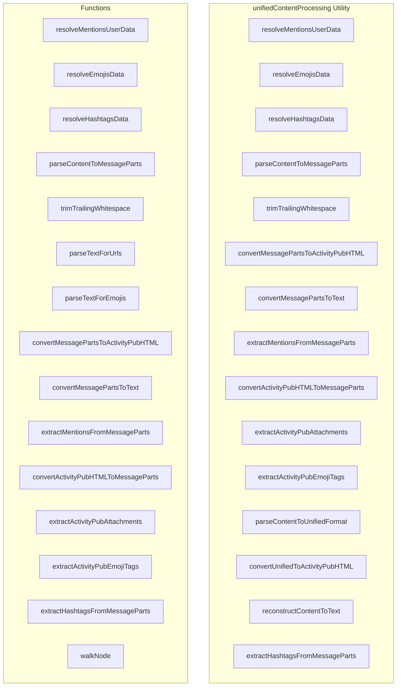

# unifiedContentProcessing Utility

**File:** `src/utils/unifiedContentProcessing.ts`

## Overview




## Exports

- **resolveMentionsUserData** - function export
- **resolveEmojisData** - function export
- **resolveHashtagsData** - function export
- **parseContentToMessageParts** - function export
- **trimTrailingWhitespace** - function export
- **convertMessagePartsToActivityPubHTML** - function export
- **convertMessagePartsToText** - function export
- **extractMentionsFromMessageParts** - function export
- **convertActivityPubHTMLToMessageParts** - function export
- **extractActivityPubAttachments** - function export
- **extractActivityPubEmojiTags** - function export
- **parseContentToUnifiedFormat** - const export
- **convertUnifiedToActivityPubHTML** - const export
- **reconstructContentToText** - const export
- **extractHashtagsFromMessageParts** - function export

## Functions

### `resolveMentionsUserData(content: string)`

No description available.

**Parameters:**
- `content: string`

**Returns:** `Promise&lt;Record&lt;string,`

```typescript
/**
 * Unified content processing system for ALL text content in Harmony
 * Used by: chat messages, DMs, ActivityPub posts, and federation
 * 
 * This replaces the fragmented approach and uses the existing MessagePart types
 * for consistency across the entire application.
 */

import type { MessagePart } from '@/types';
import { getEmoji } from '@/services/emojiService';
import { supabase } from '@/supabase';
import { debug } from '@/utils/debug'
import { resolveEmoji, loadEmojiData, isLoaded as unifiedEmojiLoaded } from '@/services/unifiedEmojiService'
import { stripTrackingParameters, isUrlTrackingStrippingEnabled } from '@/utils/urlTrackerStripper'

// Support both UUID-based emojis (legacy) and shortcode emojis (new)
const emojiUuidRegex = /:([0-9a-f]{8}-[0-9a-f]{4}-[0-9a-f]{4}-[0-9a-f]{4}-[0-9a-f]{12}):/g;
const emojiShortcodeRegex = /:([a-zA-Z0-9_+-]+):/g;

/**
 * Helper function to efficiently resolve mention user data in batch
 * This should be called before parseContentToMessageParts for optimal performance
 */
export async function resolveMentionsUserData(content: string): Promise<Record<string,
```

### `resolveEmojisData(content: string)`

No description available.

**Parameters:**
- `content: string`

**Returns:** `Promise&lt;Record&lt;string, any&gt;&gt;`

```typescript
/**
 * Helper function to efficiently resolve emoji data in batch
 * Supports both UUID-based emojis, shortcode emojis, and unified emoji pack
 */
export async function resolveEmojisData(content: string): Promise<Record<string, any>>
```

### `resolveHashtagsData(content: string)`

No description available.

**Parameters:**
- `content: string`

**Returns:** `Promise&lt;Record&lt;string,`

```typescript
/**
 * Helper function to efficiently resolve hashtag data in batch
 * This should be called before parseContentToMessageParts for optimal performance
 */
export async function resolveHashtagsData(content: string): Promise<Record<string,
```

### `parseContentToMessageParts(content: string, usernameToUserDataMap: Record&lt;string, { userId: string; isLocal: boolean; displayName?: string }&gt; = {}, emojiDataMap: Record&lt;string, any&gt; = {}, hashtagDataMap: Record&lt;string, { id: string; count: number; last_updated: string; normalized: string }&gt; = {})`

No description available.

**Parameters:**
- `content: string`
- `usernameToUserDataMap: Record&lt;string, { userId: string; isLocal: boolean; displayName?: string }&gt; = {}`
- `emojiDataMap: Record&lt;string, any&gt; = {}`
- `hashtagDataMap: Record&lt;string, { id: string; count: number; last_updated: string; normalized: string }&gt; = {}`

**Returns:** `Promise&lt;MessagePart[]&gt;`

```typescript
/**
 * Parse content string into unified MessagePart format
 * This is the SINGLE source of truth for all content parsing
 * Used by: chat, DMs, ActivityPub posts, and any text input
 */
export async function parseContentToMessageParts(
  content: string,
  usernameToUserDataMap: Record<string, { userId: string; isLocal: boolean; displayName?: string }> = {},
  emojiDataMap: Record<string, any> = {},
  hashtagDataMap: Record<string, { id: string; count: number; last_updated: string; normalized: string }> = {}
): Promise<MessagePart[]>
```

### `trimTrailingWhitespace(parts: MessagePart[])`

No description available.

**Parameters:**
- `parts: MessagePart[]`

**Returns:** `MessagePart[]`

```typescript
/**
 * Remove trailing whitespace from message parts array
 * This is called after parsing to clean up spaces added for typing convenience
 * (e.g., auto-inserted space after emoji/mention selection)
 * 
 * Benefits:
 * 1. Emojis at the end of messages display at 2x size (single-emoji detection works)
 * 2. Smaller JSON payloads (no unnecessary {"type":"text","text":" "})
 * 3. Cleaner message storage
 */
export function trimTrailingWhitespace(parts: MessagePart[]): MessagePart[]
```

### `parseTextForUrls(text: string, emojiDataMap: Record&lt;string, any&gt; = {})`

No description available.

**Parameters:**
- `text: string`
- `emojiDataMap: Record&lt;string, any&gt; = {}`

**Returns:** `Promise&lt;MessagePart[]&gt;`

```typescript
/**
 * Parse text for URLs and emojis
 * URL tracking parameter stripping is handled here to cover the entire app (ActivityPub, DMs, chat, etc.)
 */
async function parseTextForUrls(text: string, emojiDataMap: Record<string, any> = {}): Promise<MessagePart[]>
```

### `parseTextForEmojis(text: string, emojiDataMap: Record&lt;string, any&gt; = {})`

No description available.

**Parameters:**
- `text: string`
- `emojiDataMap: Record&lt;string, any&gt; = {}`

**Returns:** `Promise&lt;MessagePart[]&gt;`

```typescript
/**
 * Parse text for emoji shortcodes and return MessageParts
 * Handles both UUID-based emojis and shortcode emojis
 */
async function parseTextForEmojis(text: string, emojiDataMap: Record<string, any> = {}): Promise<MessagePart[]>
```

### `convertMessagePartsToActivityPubHTML(parts: MessagePart[])`

No description available.

**Parameters:**
- `parts: MessagePart[]`

**Returns:** `string`

```typescript
/**
 * Convert MessagePart[] to ActivityPub HTML for federation
 * This is used when sending posts/messages to remote instances
 */
export function convertMessagePartsToActivityPubHTML(parts: MessagePart[]): string
```

### `convertMessagePartsToText(parts: MessagePart[])`

No description available.

**Parameters:**
- `parts: MessagePart[]`

**Returns:** `string`

```typescript
/**
 * Convert MessagePart[] to plain text for display/reconstruction
 * This ensures proper ordering and clean text output
 */
export function convertMessagePartsToText(parts: MessagePart[]): string
```

### `extractMentionsFromMessageParts(parts: MessagePart[])`

No description available.

**Parameters:**
- `parts: MessagePart[]`

**Returns:** `Array&lt;`

```typescript
/**
 * Extract mentions from MessagePart[] for federation processing
 * Returns mention data needed for ActivityPub tag generation
 */
export function extractMentionsFromMessageParts(parts: MessagePart[]): Array<
```

### `convertActivityPubHTMLToMessageParts(html: string)`

No description available.

**Parameters:**
- `html: string`

**Returns:** `MessagePart[]`

```typescript
/**
 * Convert ActivityPub HTML content back to MessagePart[] format
 * This is used when receiving federated content from remote instances
 * Properly parses ActivityPub HTML with mentions, hashtags, and text
 */
export function convertActivityPubHTMLToMessageParts(html: string): MessagePart[]
```

### `extractActivityPubAttachments(parts: MessagePart[])`

No description available.

**Parameters:**
- `parts: MessagePart[]`

**Returns:** `any[]`

```typescript
/**
 * Extract ActivityPub attachments from MessagePart content
 * Returns properly formatted ActivityPub attachment objects
 */
export function extractActivityPubAttachments(parts: MessagePart[]): any[]
```

### `extractActivityPubEmojiTags(parts: MessagePart[], baseUrl?: string)`

No description available.

**Parameters:**
- `parts: MessagePart[]`
- `baseUrl?: string`

**Returns:** `any[]`

```typescript
/**
 * Extract emoji tags for ActivityPub federation (Misskey compatibility)
 * Returns properly formatted emoji tag objects
 */
export function extractActivityPubEmojiTags(parts: MessagePart[], baseUrl?: string): any[]
```

### `extractHashtagsFromMessageParts(parts: MessagePart[])`

No description available.

**Parameters:**
- `parts: MessagePart[]`

**Returns:** `Array&lt;`

```typescript
/**
 * Extract hashtags from MessagePart[] for database processing
 * Returns hashtag data needed for post_hashtags table insertion
 */
export function extractHashtagsFromMessageParts(parts: MessagePart[]): Array<
```

### `walkNode(node: Node)`

No description available.

**Parameters:**
- `node: Node`

**Returns:** `void`

```typescript
const walkNode = (node: Node): void =>
```


## Source Code Insights

**File Size:** 30015 characters
**Lines of Code:** 851
**Imports:** 6

## Usage Example

```typescript
import { resolveMentionsUserData, resolveEmojisData, resolveHashtagsData, parseContentToMessageParts, trimTrailingWhitespace, convertMessagePartsToActivityPubHTML, convertMessagePartsToText, extractMentionsFromMessageParts, convertActivityPubHTMLToMessageParts, extractActivityPubAttachments, extractActivityPubEmojiTags, parseContentToUnifiedFormat, convertUnifiedToActivityPubHTML, reconstructContentToText, extractHashtagsFromMessageParts } from '@/utils/unifiedContentProcessing'

// Example usage
resolveMentionsUserData()
```

---

*This documentation was automatically generated from the source code.*