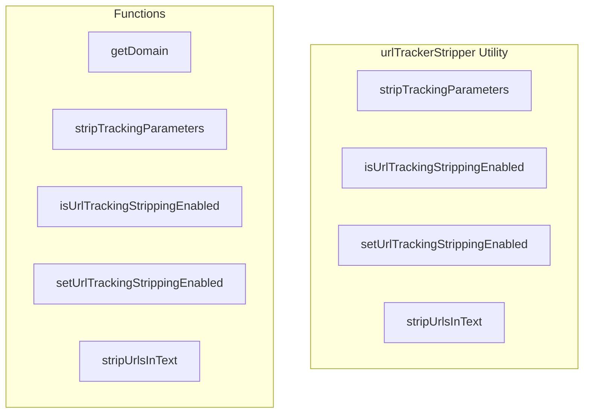

# urlTrackerStripper Utility

**File:** `src/utils/urlTrackerStripper.ts`

## Overview




## Exports

- **stripTrackingParameters** - function export
- **isUrlTrackingStrippingEnabled** - function export
- **setUrlTrackingStrippingEnabled** - function export
- **stripUrlsInText** - function export

## Functions

### `getDomain(url: string)`

No description available.

**Parameters:**
- `url: string`

**Returns:** `string | null`

```typescript
/**
 * Utility functions to strip tracking parameters from URLs
 * Supports: YouTube, X/Twitter, TikTok, Instagram, Facebook
 */

/**
 * Known tracking parameters for each platform
 */
const TRACKING_PARAMS: Record<string, string[]> = {
  // YouTube (youtu.be and youtube.com)
  'youtube.com': ['si', 'feature', 'utm_source', 'utm_medium', 'utm_campaign', 'utm_content', 'utm_term', 'gclid', 'fbclid'],
  'youtu.be': ['si', 'feature', 'utm_source', 'utm_medium', 'utm_campaign', 'utm_content', 'utm_term', 'gclid', 'fbclid'],
  
  // X/Twitter
  'twitter.com': ['s', 't', 'ref_src', 'ref_url', 'utm_source', 'utm_medium', 'utm_campaign'],
  'x.com': ['s', 't', 'ref_src', 'ref_url', 'utm_source', 'utm_medium', 'utm_campaign'],
  
  // TikTok
  'tiktok.com': ['is_from_webapp', 'is_copy_url', 'sender_device', 'sender_web_id', 'share_id', 'share_app_id', 'share_link_id', 'share_item_id', 'share_channel'],
  
  // Instagram
  'instagram.com': ['igshid', 'igsh', 'utm_source', 'utm_medium', 'utm_campaign'],
  
  // Facebook
  'facebook.com': ['fbclid', 'ref', 'refsrc', 'utm_source', 'utm_medium', 'utm_campaign'],
  'fb.com': ['fbclid', 'ref', 'refsrc', 'utm_source', 'utm_medium', 'utm_campaign'],
  'm.facebook.com': ['fbclid', 'ref', 'refsrc', 'utm_source', 'utm_medium', 'utm_campaign'],
}

/**
 * Get the domain from a URL
 */
function getDomain(url: string): string | null
```

### `stripTrackingParameters(url: string)`

No description available.

**Parameters:**
- `url: string`

**Returns:** `string`

```typescript
/**
 * Strip tracking parameters from a URL
 * @param url The URL to clean
 * @returns The cleaned URL without tracking parameters
 */
export function stripTrackingParameters(url: string): string
```

### `isUrlTrackingStrippingEnabled()`

No description available.

**Parameters:**
None

**Returns:** `boolean`

```typescript
/**
 * Check if URL stripping is enabled for the current user
 */
export function isUrlTrackingStrippingEnabled(): boolean
```

### `setUrlTrackingStrippingEnabled(enabled: boolean)`

No description available.

**Parameters:**
- `enabled: boolean`

**Returns:** `void`

```typescript
/**
 * Set URL tracking stripping preference
 */
export function setUrlTrackingStrippingEnabled(enabled: boolean): void
```

### `stripUrlsInText(text: string)`

No description available.

**Parameters:**
- `text: string`

**Returns:** `string`

```typescript
/**
 * Strip tracking parameters from all URLs in a text string
 * This is used before parsing message content to clean URLs in the raw text
 * @param text The text content that may contain URLs
 * @returns The text with all URLs cleaned
 */
export function stripUrlsInText(text: string): string
```


## Constants

### TRACKING_PARAMS

No description available.

```typescript
const TRACKING_PARAMS: Record<string, string[]> = {
```


## Source Code Insights

**File Size:** 3682 characters
**Lines of Code:** 120
**Imports:** 0

## Usage Example

```typescript
import { stripTrackingParameters, isUrlTrackingStrippingEnabled, setUrlTrackingStrippingEnabled, stripUrlsInText } from '@/utils/urlTrackerStripper'

// Example usage
getDomain()
```

---

*This documentation was automatically generated from the source code.*