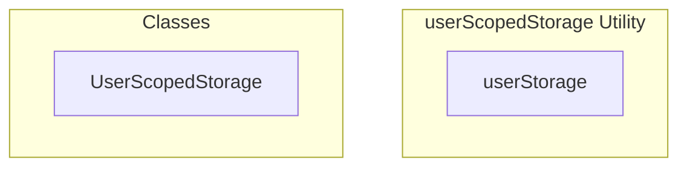

# userScopedStorage Utility

**File:** `src/utils/userScopedStorage.ts`

## Overview




## Exports

- **userStorage** - const export


## Classes

### UserScopedStorage

No description available.

**Methods:**
- `initialize`
- `catch`
- `setCurrentUser`
- `getCurrentUser`
- `clearCurrentUser`
- `clearUserData`
- `getUserKey`
- `key`
- `setItem`
- `getItem`
- `removeItem`
- `hasItem`
- `getUserKeys`
- `clearAll`

**Properties:**
- `currentUserId`
- `warnedKeys`
- `session`
- `storedUserId`
- `user`
- `storage`
- `set`
- `users`
- `userId`
- `ID`
- `null`
- `keysToRemove`
- `i`
- `key`
- `keys`
- `data`
- `logs`
- `value`
- `userKey`
- `error`
- `prefix`


## Constants

### STORAGE_PREFIX

No description available.

```typescript
const STORAGE_PREFIX = 'harmony_'
```

### USER_ID_KEY

No description available.

```typescript
const USER_ID_KEY = `${STORAGE_PREFIX}current_user_id`
```

### USER_DATA_PREFIX

No description available.

```typescript
const USER_DATA_PREFIX = `${STORAGE_PREFIX}user_`
```


## Source Code Insights

**File Size:** 6323 characters
**Lines of Code:** 237
**Imports:** 1

## Usage Example

```typescript
import { userStorage } from '@/utils/userScopedStorage'

// Example usage
// Use the exported functionality
```

---

*This documentation was automatically generated from the source code.*