# AdminPanel View

**File:** `src/views/AdminPanel.vue`

## Overview

```mermaid
graph TB
    subgraph "AdminPanel View"
    end
    
    subgraph "Functions"
        FN_LOADINITIALDATA[loadInitialData]
        FN_LOADRECENTACTIVITY[loadRecentActivity]
        FN_LOADSYSTEMSTATS[loadSystemStats]
        FN_LOADUSERS[loadUsers]
        FN_LOADSYSTEMHEALTH[loadSystemHealth]
        FN_LOADINSTANCECONFIG[loadInstanceConfig]
        FN_REFRESHDATA[refreshData]
        FN_EXPORTLOGS[exportLogs]
        FN_BLOCKINSTANCE[blockInstance]
        FN_UNBLOCKINSTANCE[unblockInstance]
        FN_TOGGLEMODERATOR[toggleModerator]
        FN_MODERATEUSER[moderateUser]
        FN_NAVIGATETOUSERPOSTS[navigateToUserPosts]
        FN_NAVIGATETOUSERSERVERS[navigateToUserServers]
        FN_CLOSESERVERSMODAL[closeServersModal]
        FN_NAVIGATETOSERVER[navigateToServer]
        FN_SAVECONFIG[saveConfig]
        FN_SAVEINSTANCEBRANDING[saveInstanceBranding]
        FN_SAVEOAUTHPROVIDERS[saveOAuthProviders]
        FN_FORMATUPTIME[formatUptime]
        FN_FORMATNUMBER[formatNumber]
        FN_FORMATDATE[formatDate]
        FN_FORMATTIME[formatTime]
        FN_GETACTIVITYICON[getActivityIcon]
        FN_REFRESHFEDERATIONDATA[refreshFederationData]
        FN_LOADFEDERATIONSTATS[loadFederationStats]
        FN_GETENDPOINTHEALTHCLASS[getEndpointHealthClass]
        FN_REFRESHKEYCONSISTENCY[refreshKeyConsistency]
        FN_RUNKEYGENERATIONSWEEP[runKeyGenerationSweep]
        FN_RUNORPHANCLEANUP[runOrphanCleanup]
        FN_LOADINSTANCESTATS[loadInstanceStats]
        FN_LOADFEDERATEDINSTANCES[loadFederatedInstances]
        FN_DEBOUNCEDSEARCHINSTANCES[debouncedSearchInstances]
        FN_LOADPREVIOUSINSTANCES[loadPreviousInstances]
        FN_LOADNEXTINSTANCES[loadNextInstances]
        FN_ISINSTANCEINACTIVE[isInstanceInactive]
        FN_FORMATRELATIVETIME[formatRelativeTime]
        FN_REFRESHINSTANCE[refreshInstance]
        FN_TOGGLEINSTANCETRUST[toggleInstanceTrust]
        FN_TOGGLEINSTANCEBLOCK[toggleInstanceBlock]
        FN_DELETEINSTANCE[deleteInstance]
        FN_LOADDISCOVEREDINSTANCES[loadDiscoveredInstances]
        FN_ADDDISCOVEREDINSTANCE[addDiscoveredInstance]
        FN_DISCOVERINSTANCE[discoverInstance]
        FN_ADDINSTANCEFROMDISCOVERY[addInstanceFromDiscovery]
        FN_HANDLEADDINSTANCE[handleAddInstance]
    end
```




## Functions

### `loadInitialData()`

No description available.

**Parameters:**
None

**Returns:** `Unknown`

```typescript
const loadInitialData = async () =>
```

### `loadRecentActivity()`

No description available.

**Parameters:**
None

**Returns:** `Unknown`

```typescript
const loadRecentActivity = async () =>
```

### `loadSystemStats()`

No description available.

**Parameters:**
None

**Returns:** `Unknown`

```typescript
const loadSystemStats = async () =>
```

### `loadUsers()`

No description available.

**Parameters:**
None

**Returns:** `Unknown`

```typescript
const loadUsers = async () =>
```

### `loadSystemHealth()`

No description available.

**Parameters:**
None

**Returns:** `Unknown`

```typescript
const loadSystemHealth = async () =>
```

### `loadInstanceConfig()`

No description available.

**Parameters:**
None

**Returns:** `Unknown`

```typescript
const loadInstanceConfig = async () =>
```

### `refreshData()`

No description available.

**Parameters:**
None

**Returns:** `Unknown`

```typescript
const refreshData = async () =>
```

### `exportLogs()`

No description available.

**Parameters:**
None

**Returns:** `Unknown`

```typescript
const exportLogs = () =>
```

### `blockInstance()`

No description available.

**Parameters:**
None

**Returns:** `Unknown`

```typescript
const blockInstance = async () =>
```

### `unblockInstance(domain: string)`

No description available.

**Parameters:**
- `domain: string`

**Returns:** `Unknown`

```typescript
const unblockInstance = async (domain: string) =>
```

### `toggleModerator(user: any)`

No description available.

**Parameters:**
- `user: any`

**Returns:** `Unknown`

```typescript
const toggleModerator = async (user: any) =>
```

### `moderateUser(user: any, action: string)`

No description available.

**Parameters:**
- `user: any`
- `action: string`

**Returns:** `Unknown`

```typescript
const moderateUser = async (user: any, action: string) =>
```

### `navigateToUserPosts(user: any)`

No description available.

**Parameters:**
- `user: any`

**Returns:** `Unknown`

```typescript
const navigateToUserPosts = (user: any) =>
```

### `navigateToUserServers(user: AdminUser)`

No description available.

**Parameters:**
- `user: AdminUser`

**Returns:** `Unknown`

```typescript
const navigateToUserServers = async (user: AdminUser) =>
```

### `closeServersModal()`

No description available.

**Parameters:**
None

**Returns:** `Unknown`

```typescript
const closeServersModal = () =>
```

### `navigateToServer(serverId: string)`

No description available.

**Parameters:**
- `serverId: string`

**Returns:** `Unknown`

```typescript
const navigateToServer = (serverId: string) =>
```

### `saveConfig()`

No description available.

**Parameters:**
None

**Returns:** `Unknown`

```typescript
const saveConfig = async () =>
```

### `saveInstanceBranding()`

No description available.

**Parameters:**
None

**Returns:** `Unknown`

```typescript
const saveInstanceBranding = async () =>
```

### `saveOAuthProviders()`

No description available.

**Parameters:**
None

**Returns:** `Unknown`

```typescript
const saveOAuthProviders = async () =>
```

### `formatUptime(timestamp: number)`

No description available.

**Parameters:**
- `timestamp: number`

**Returns:** `Unknown`

```typescript
const formatUptime = (timestamp: number) =>
```

### `formatNumber(num: number | undefined)`

No description available.

**Parameters:**
- `num: number | undefined`

**Returns:** `Unknown`

```typescript
const formatNumber = (num: number | undefined) =>
```

### `formatDate(date: string)`

No description available.

**Parameters:**
- `date: string`

**Returns:** `Unknown`

```typescript
const formatDate = (date: string) =>
```

### `formatTime(date: Date)`

No description available.

**Parameters:**
- `date: Date`

**Returns:** `Unknown`

```typescript
const formatTime = (date: Date) =>
```

### `getActivityIcon(type: string)`

No description available.

**Parameters:**
- `type: string`

**Returns:** `Unknown`

```typescript
const getActivityIcon = (type: string) =>
```

### `refreshFederationData()`

No description available.

**Parameters:**
None

**Returns:** `Unknown`

```typescript
const refreshFederationData = async () =>
```

### `loadFederationStats()`

No description available.

**Parameters:**
None

**Returns:** `Unknown`

```typescript
const loadFederationStats = async () =>
```

### `getEndpointHealthClass(health: FederationStats['endpoint_health'])`

No description available.

**Parameters:**
- `health: FederationStats['endpoint_health']`

**Returns:** `Unknown`

```typescript
const getEndpointHealthClass = (health: FederationStats['endpoint_health']) =>
```

### `refreshKeyConsistency()`

No description available.

**Parameters:**
None

**Returns:** `Unknown`

```typescript
const refreshKeyConsistency = async () =>
```

### `runKeyGenerationSweep()`

No description available.

**Parameters:**
None

**Returns:** `Unknown`

```typescript
const runKeyGenerationSweep = async () =>
```

### `runOrphanCleanup()`

No description available.

**Parameters:**
None

**Returns:** `Unknown`

```typescript
const runOrphanCleanup = async () =>
```

### `loadInstanceStats()`

No description available.

**Parameters:**
None

**Returns:** `Unknown`

```typescript
const loadInstanceStats = async () =>
```

### `loadFederatedInstances()`

No description available.

**Parameters:**
None

**Returns:** `Unknown`

```typescript
const loadFederatedInstances = async () =>
```

### `debouncedSearchInstances(()`

No description available.

**Parameters:**
- `(`

**Returns:** `Unknown`

```typescript
const debouncedSearchInstances = (() =>
```

### `loadPreviousInstances()`

No description available.

**Parameters:**
None

**Returns:** `Unknown`

```typescript
const loadPreviousInstances = () =>
```

### `loadNextInstances()`

No description available.

**Parameters:**
None

**Returns:** `Unknown`

```typescript
const loadNextInstances = () =>
```

### `isInstanceInactive(instance: FederatedInstance)`

No description available.

**Parameters:**
- `instance: FederatedInstance`

**Returns:** `Unknown`

```typescript
const isInstanceInactive = (instance: FederatedInstance) =>
```

### `formatRelativeTime(dateString: string)`

No description available.

**Parameters:**
- `dateString: string`

**Returns:** `Unknown`

```typescript
const formatRelativeTime = (dateString: string) =>
```

### `refreshInstance(instanceId: string)`

No description available.

**Parameters:**
- `instanceId: string`

**Returns:** `Unknown`

```typescript
const refreshInstance = async (instanceId: string) =>
```

### `toggleInstanceTrust(instanceId: string, trusted: boolean)`

No description available.

**Parameters:**
- `instanceId: string`
- `trusted: boolean`

**Returns:** `Unknown`

```typescript
const toggleInstanceTrust = async (instanceId: string, trusted: boolean) =>
```

### `toggleInstanceBlock(instanceId: string, blocked: boolean)`

No description available.

**Parameters:**
- `instanceId: string`
- `blocked: boolean`

**Returns:** `Unknown`

```typescript
const toggleInstanceBlock = async (instanceId: string, blocked: boolean) =>
```

### `deleteInstance(instanceId: string)`

No description available.

**Parameters:**
- `instanceId: string`

**Returns:** `Unknown`

```typescript
const deleteInstance = async (instanceId: string) =>
```

### `loadDiscoveredInstances()`

No description available.

**Parameters:**
None

**Returns:** `Unknown`

```typescript
const loadDiscoveredInstances = async () =>
```

### `addDiscoveredInstance(domain: string)`

No description available.

**Parameters:**
- `domain: string`

**Returns:** `Unknown`

```typescript
const addDiscoveredInstance = async (domain: string) =>
```

### `discoverInstance()`

No description available.

**Parameters:**
None

**Returns:** `Unknown`

```typescript
const discoverInstance = async () =>
```

### `addInstanceFromDiscovery()`

No description available.

**Parameters:**
None

**Returns:** `Unknown`

```typescript
const addInstanceFromDiscovery = async () =>
```

### `handleAddInstance()`

No description available.

**Parameters:**
None

**Returns:** `Unknown`

```typescript
const handleAddInstance = () =>
```


## Vue Component

This is a Vue component file.


## Source Code Insights

**File Size:** 95448 characters
**Lines of Code:** 3465
**Imports:** 12

## Usage Example

```typescript
import { AdminPanel } from '@/views/AdminPanel'

// Example usage
loadInitialData()
```

---

*This documentation was automatically generated from the source code.*