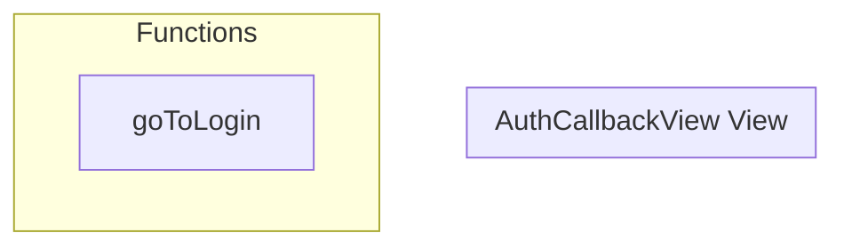

# AuthCallbackView View

**File:** `src/views/AuthCallbackView.vue`

## Overview




## Functions

### `goToLogin()`

No description available.

**Parameters:**
None

**Returns:** `Unknown`

```typescript
const goToLogin = () =>
```


## Vue Component

This is a Vue component file.


## Source Code Insights

**File Size:** 9172 characters
**Lines of Code:** 342
**Imports:** 5

## Usage Example

```typescript
import { AuthCallbackView } from '@/views/AuthCallbackView'

// Example usage
goToLogin()
```

---

*This documentation was automatically generated from the source code.*