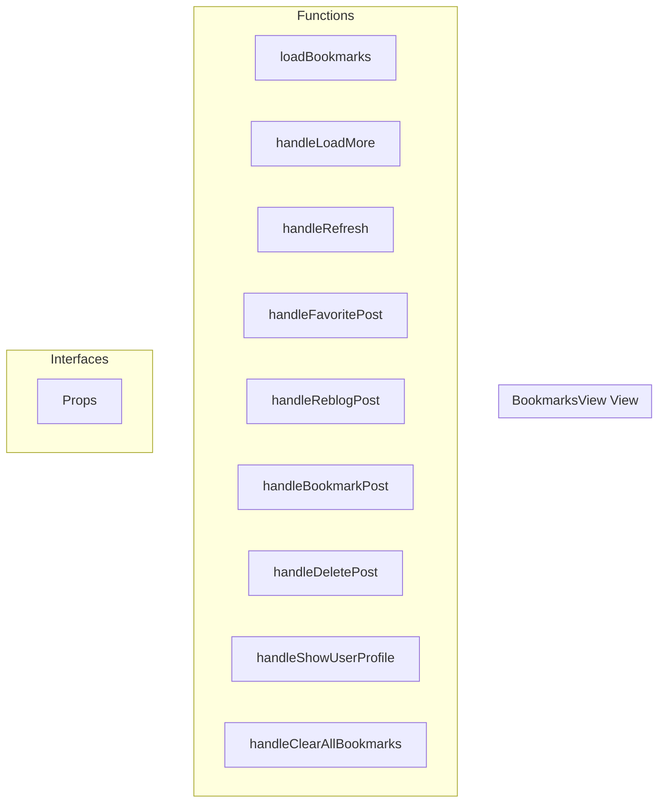

# BookmarksView View

**File:** `src/views/BookmarksView.vue`

## Overview




## Functions

### `loadBookmarks()`

No description available.

**Parameters:**
None

**Returns:** `Unknown`

```typescript
const loadBookmarks = async () =>
```

### `handleLoadMore()`

No description available.

**Parameters:**
None

**Returns:** `Unknown`

```typescript
const handleLoadMore = async () =>
```

### `handleRefresh()`

No description available.

**Parameters:**
None

**Returns:** `Unknown`

```typescript
const handleRefresh = () =>
```

### `handleFavoritePost(post: TimelinePost)`

No description available.

**Parameters:**
- `post: TimelinePost`

**Returns:** `Unknown`

```typescript
const handleFavoritePost = async (post: TimelinePost) =>
```

### `handleReblogPost(post: TimelinePost)`

No description available.

**Parameters:**
- `post: TimelinePost`

**Returns:** `Unknown`

```typescript
const handleReblogPost = async (post: TimelinePost) =>
```

### `handleBookmarkPost(post: TimelinePost)`

No description available.

**Parameters:**
- `post: TimelinePost`

**Returns:** `Unknown`

```typescript
const handleBookmarkPost = async (post: TimelinePost) =>
```

### `handleDeletePost(post: TimelinePost)`

No description available.

**Parameters:**
- `post: TimelinePost`

**Returns:** `Unknown`

```typescript
const handleDeletePost = async (post: TimelinePost) =>
```

### `handleShowUserProfile(user: FederatedUser)`

No description available.

**Parameters:**
- `user: FederatedUser`

**Returns:** `Unknown`

```typescript
const handleShowUserProfile = (user: FederatedUser) =>
```

### `handleClearAllBookmarks()`

No description available.

**Parameters:**
None

**Returns:** `Unknown`

```typescript
const handleClearAllBookmarks = async () =>
```


## Interfaces

### Props

No description available.

```typescript
interface Props {

  currentView: string
  viewType: string

}
```


## Vue Component

This is a Vue component file.


## Source Code Insights

**File Size:** 3575 characters
**Lines of Code:** 151
**Imports:** 5

## Usage Example

```typescript
import { BookmarksView } from '@/views/BookmarksView'

// Example usage
loadBookmarks()
```

---

*This documentation was automatically generated from the source code.*