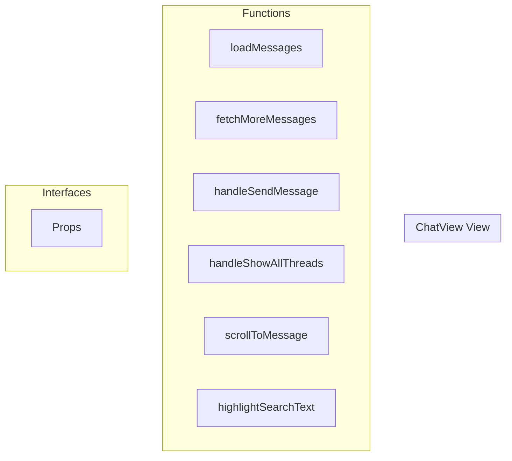

# ChatView View

**File:** `src/views/ChatView.vue`

## Overview




## Functions

### `loadMessages()`

No description available.

**Parameters:**
None

**Returns:** `Unknown`

```typescript
const loadMessages = async () =>
```

### `fetchMoreMessages()`

No description available.

**Parameters:**
None

**Returns:** `Unknown`

```typescript
const fetchMoreMessages = async () =>
```

### `handleSendMessage(message: any)`

No description available.

**Parameters:**
- `message: any`

**Returns:** `Unknown`

```typescript
const handleSendMessage = (message: any) =>
```

### `handleShowAllThreads()`

No description available.

**Parameters:**
None

**Returns:** `Unknown`

```typescript
const handleShowAllThreads = () =>
```

### `scrollToMessage(messageId: string)`

No description available.

**Parameters:**
- `messageId: string`

**Returns:** `Unknown`

```typescript
const scrollToMessage = async (messageId: string) =>
```

### `highlightSearchText(messageElement: HTMLElement, query: string)`

No description available.

**Parameters:**
- `messageElement: HTMLElement`
- `query: string`

**Returns:** `Unknown`

```typescript
const highlightSearchText = (messageElement: HTMLElement, query: string) =>
```


## Interfaces

### Props

No description available.

```typescript
interface Props {

  currentServer?: any
  currentChannel?: any
  isDM?: boolean

}
```


## Vue Component

This is a Vue component file.


## Source Code Insights

**File Size:** 12785 characters
**Lines of Code:** 378
**Imports:** 10

## Usage Example

```typescript
import { ChatView } from '@/views/ChatView'

// Example usage
loadMessages()
```

---

*This documentation was automatically generated from the source code.*