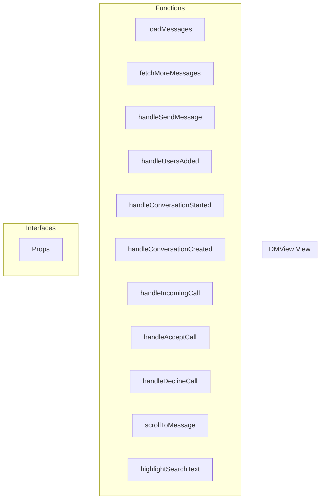

# DMView View

**File:** `src/views/DMView.vue`

## Overview




## Functions

### `loadMessages()`

No description available.

**Parameters:**
None

**Returns:** `Unknown`

```typescript
const loadMessages = async () =>
```

### `fetchMoreMessages()`

No description available.

**Parameters:**
None

**Returns:** `Unknown`

```typescript
const fetchMoreMessages = async () =>
```

### `handleSendMessage(content: MessagePart[], replyTo?: string)`

No description available.

**Parameters:**
- `content: MessagePart[]`
- `replyTo?: string`

**Returns:** `Unknown`

```typescript
const handleSendMessage = async (content: MessagePart[], replyTo?: string) =>
```

### `handleUsersAdded(conversationId: string, userIds: string[])`

No description available.

**Parameters:**
- `conversationId: string`
- `userIds: string[]`

**Returns:** `Unknown`

```typescript
const handleUsersAdded = async (conversationId: string, userIds: string[]) =>
```

### `handleConversationStarted(conversationId: string)`

No description available.

**Parameters:**
- `conversationId: string`

**Returns:** `Unknown`

```typescript
const handleConversationStarted = async (conversationId: string) =>
```

### `handleConversationCreated(newConversationId: string)`

No description available.

**Parameters:**
- `newConversationId: string`

**Returns:** `Unknown`

```typescript
const handleConversationCreated = async (newConversationId: string) =>
```

### `handleIncomingCall(payload: { callerId: string, callType: 'voice' | 'video', conversationId: string })`

No description available.

**Parameters:**
- `payload: { callerId: string, callType: 'voice' | 'video', conversationId: string }`

**Returns:** `Unknown`

```typescript
const handleIncomingCall = (payload: { callerId: string, callType: 'voice' | 'video', conversationId: string }) =>
```

### `handleAcceptCall(acceptWithVideo: boolean)`

No description available.

**Parameters:**
- `acceptWithVideo: boolean`

**Returns:** `Unknown`

```typescript
const handleAcceptCall = async (acceptWithVideo: boolean) =>
```

### `handleDeclineCall()`

No description available.

**Parameters:**
None

**Returns:** `Unknown`

```typescript
const handleDeclineCall = async () =>
```

### `scrollToMessage(messageId: string)`

No description available.

**Parameters:**
- `messageId: string`

**Returns:** `Unknown`

```typescript
const scrollToMessage = async (messageId: string) =>
```

### `highlightSearchText(messageElement: HTMLElement, query: string)`

No description available.

**Parameters:**
- `messageElement: HTMLElement`
- `query: string`

**Returns:** `Unknown`

```typescript
const highlightSearchText = (messageElement: HTMLElement, query: string) =>
```


## Interfaces

### Props

No description available.

```typescript
interface Props {

  isDM: boolean
  conversationId?: string

}
```


## Vue Component

This is a Vue component file.


## Source Code Insights

**File Size:** 17093 characters
**Lines of Code:** 536
**Imports:** 17

## Usage Example

```typescript
import { DMView } from '@/views/DMView'

// Example usage
loadMessages()
```

---

*This documentation was automatically generated from the source code.*