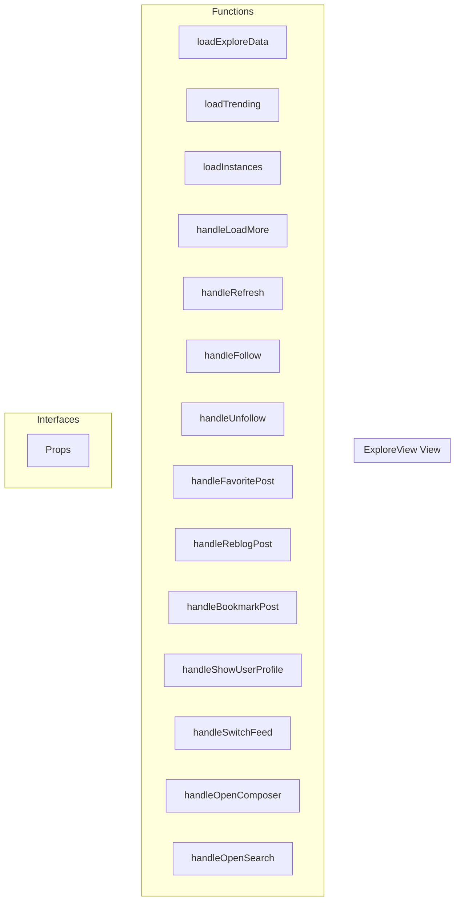

# ExploreView View

**File:** `src/views/ExploreView.vue`

## Overview




## Functions

### `loadExploreData()`

No description available.

**Parameters:**
None

**Returns:** `Unknown`

```typescript
const loadExploreData = async () =>
```

### `loadTrending()`

No description available.

**Parameters:**
None

**Returns:** `Unknown`

```typescript
const loadTrending = async () =>
```

### `loadInstances()`

No description available.

**Parameters:**
None

**Returns:** `Unknown`

```typescript
const loadInstances = async () =>
```

### `handleLoadMore()`

No description available.

**Parameters:**
None

**Returns:** `Unknown`

```typescript
const handleLoadMore = async () =>
```

### `handleRefresh()`

No description available.

**Parameters:**
None

**Returns:** `Unknown`

```typescript
const handleRefresh = () =>
```

### `handleFollow(userId: string)`

No description available.

**Parameters:**
- `userId: string`

**Returns:** `Unknown`

```typescript
const handleFollow = async (userId: string) =>
```

### `handleUnfollow(userId: string)`

No description available.

**Parameters:**
- `userId: string`

**Returns:** `Unknown`

```typescript
const handleUnfollow = async (userId: string) =>
```

### `handleFavoritePost(postId: string)`

No description available.

**Parameters:**
- `postId: string`

**Returns:** `Unknown`

```typescript
const handleFavoritePost = async (postId: string) =>
```

### `handleReblogPost(postId: string)`

No description available.

**Parameters:**
- `postId: string`

**Returns:** `Unknown`

```typescript
const handleReblogPost = async (postId: string) =>
```

### `handleBookmarkPost(postId: string)`

No description available.

**Parameters:**
- `postId: string`

**Returns:** `Unknown`

```typescript
const handleBookmarkPost = async (postId: string) =>
```

### `handleShowUserProfile(user: FederatedUser)`

No description available.

**Parameters:**
- `user: FederatedUser`

**Returns:** `Unknown`

```typescript
const handleShowUserProfile = (user: FederatedUser) =>
```

### `handleSwitchFeed(feed: string)`

No description available.

**Parameters:**
- `feed: string`

**Returns:** `Unknown`

```typescript
const handleSwitchFeed = (feed: string) =>
```

### `handleOpenComposer()`

No description available.

**Parameters:**
None

**Returns:** `Unknown`

```typescript
const handleOpenComposer = () =>
```

### `handleOpenSearch()`

No description available.

**Parameters:**
None

**Returns:** `Unknown`

```typescript
const handleOpenSearch = () =>
```


## Interfaces

### Props

No description available.

```typescript
interface Props {

  currentView: 'trending' | 'instances'

}
```


## Vue Component

This is a Vue component file.


## Source Code Insights

**File Size:** 6914 characters
**Lines of Code:** 252
**Imports:** 9

## Usage Example

```typescript
import { ExploreView } from '@/views/ExploreView'

// Example usage
loadExploreData()
```

---

*This documentation was automatically generated from the source code.*