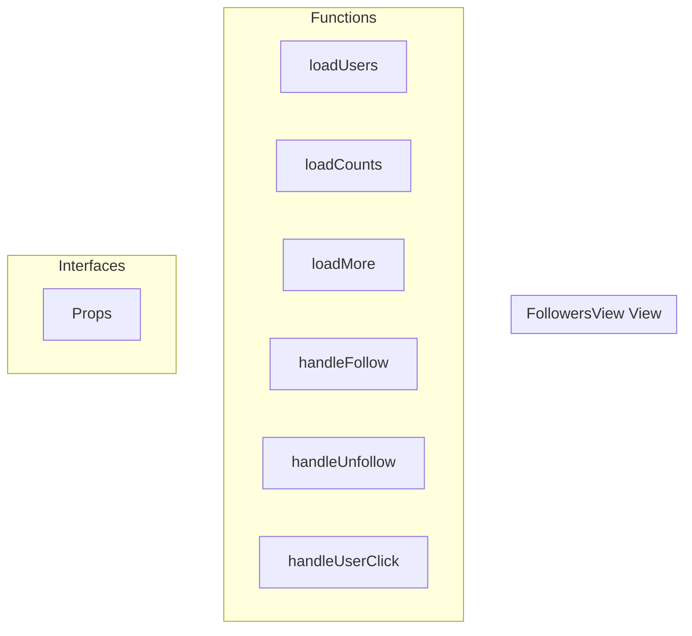

# FollowersView View

**File:** `src/views/FollowersView.vue`

## Overview




## Functions

### `loadUsers(refresh = false)`

No description available.

**Parameters:**
- `refresh = false`

**Returns:** `Unknown`

```typescript
const loadUsers = async (refresh = false) =>
```

### `loadCounts()`

No description available.

**Parameters:**
None

**Returns:** `Unknown`

```typescript
const loadCounts = async () =>
```

### `loadMore()`

No description available.

**Parameters:**
None

**Returns:** `Unknown`

```typescript
const loadMore = () =>
```

### `handleFollow(userId: string)`

No description available.

**Parameters:**
- `userId: string`

**Returns:** `Unknown`

```typescript
const handleFollow = (userId: string) =>
```

### `handleUnfollow(userId: string)`

No description available.

**Parameters:**
- `userId: string`

**Returns:** `Unknown`

```typescript
const handleUnfollow = (userId: string) =>
```

### `handleUserClick(user: FederatedUser)`

No description available.

**Parameters:**
- `user: FederatedUser`

**Returns:** `Unknown`

```typescript
const handleUserClick = (user: FederatedUser) =>
```


## Interfaces

### Props

No description available.

```typescript
interface Props {

  userId?: string;
  view?: 'followers' | 'following';
  userProfile?: any; // Optional: if provided, use its counts instead of querying

}
```


## Vue Component

This is a Vue component file.


## Source Code Insights

**File Size:** 12313 characters
**Lines of Code:** 517
**Imports:** 12

## Usage Example

```typescript
import { FollowersView } from '@/views/FollowersView'

// Example usage
loadUsers()
```

---

*This documentation was automatically generated from the source code.*