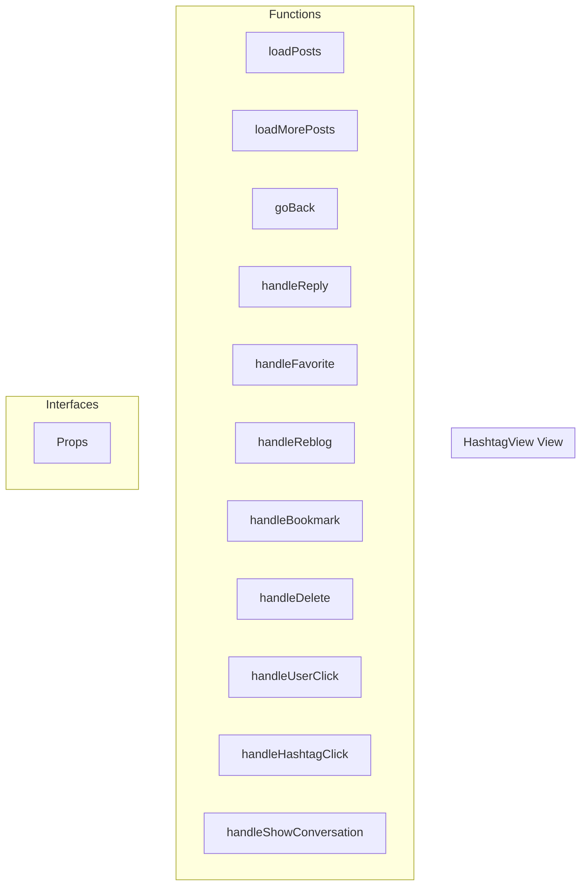

# HashtagView View

**File:** `src/views/HashtagView.vue`

## Overview




## Functions

### `loadPosts()`

No description available.

**Parameters:**
None

**Returns:** `Unknown`

```typescript
const loadPosts = async () =>
```

### `loadMorePosts()`

No description available.

**Parameters:**
None

**Returns:** `Unknown`

```typescript
const loadMorePosts = async () =>
```

### `goBack()`

No description available.

**Parameters:**
None

**Returns:** `Unknown`

```typescript
const goBack = () =>
```

### `handleReply(post: TimelinePost)`

No description available.

**Parameters:**
- `post: TimelinePost`

**Returns:** `Unknown`

```typescript
const handleReply = (post: TimelinePost) =>
```

### `handleFavorite(postId: string)`

No description available.

**Parameters:**
- `postId: string`

**Returns:** `Unknown`

```typescript
const handleFavorite = async (postId: string) =>
```

### `handleReblog(postId: string)`

No description available.

**Parameters:**
- `postId: string`

**Returns:** `Unknown`

```typescript
const handleReblog = async (postId: string) =>
```

### `handleBookmark(postId: string)`

No description available.

**Parameters:**
- `postId: string`

**Returns:** `Unknown`

```typescript
const handleBookmark = async (postId: string) =>
```

### `handleDelete(postId: string)`

No description available.

**Parameters:**
- `postId: string`

**Returns:** `Unknown`

```typescript
const handleDelete = async (postId: string) =>
```

### `handleUserClick(user: any)`

No description available.

**Parameters:**
- `user: any`

**Returns:** `Unknown`

```typescript
const handleUserClick = (user: any) =>
```

### `handleHashtagClick(tag: string)`

No description available.

**Parameters:**
- `tag: string`

**Returns:** `Unknown`

```typescript
const handleHashtagClick = (tag: string) =>
```

### `handleShowConversation(postId: string)`

No description available.

**Parameters:**
- `postId: string`

**Returns:** `Unknown`

```typescript
const handleShowConversation = (postId: string) =>
```


## Interfaces

### Props

No description available.

```typescript
interface Props {

  hashtag: string
  currentView?: string
  viewType?: string

}
```


## Vue Component

This is a Vue component file.


## Source Code Insights

**File Size:** 7367 characters
**Lines of Code:** 319
**Imports:** 9

## Usage Example

```typescript
import { HashtagView } from '@/views/HashtagView'

// Example usage
loadPosts()
```

---

*This documentation was automatically generated from the source code.*