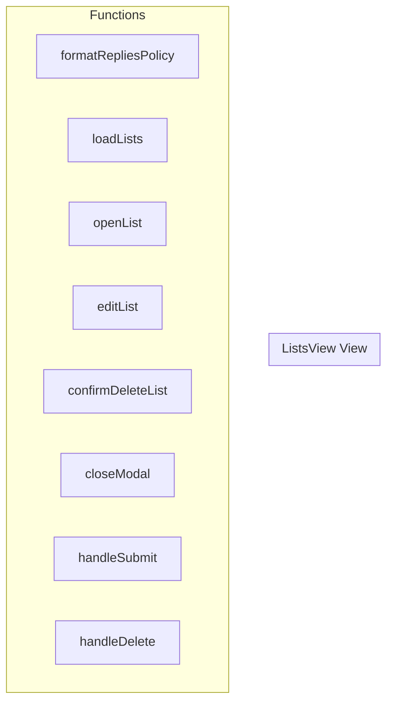

# ListsView View

**File:** `src/views/ListsView.vue`

## Overview




## Functions

### `formatRepliesPolicy(policy: string)`

No description available.

**Parameters:**
- `policy: string`

**Returns:** `Unknown`

```typescript
const formatRepliesPolicy = (policy: string) =>
```

### `loadLists()`

No description available.

**Parameters:**
None

**Returns:** `Unknown`

```typescript
const loadLists = async () =>
```

### `openList(list: UserList)`

No description available.

**Parameters:**
- `list: UserList`

**Returns:** `Unknown`

```typescript
const openList = (list: UserList) =>
```

### `editList(list: UserList)`

No description available.

**Parameters:**
- `list: UserList`

**Returns:** `Unknown`

```typescript
const editList = (list: UserList) =>
```

### `confirmDeleteList(list: UserList)`

No description available.

**Parameters:**
- `list: UserList`

**Returns:** `Unknown`

```typescript
const confirmDeleteList = (list: UserList) =>
```

### `closeModal()`

No description available.

**Parameters:**
None

**Returns:** `Unknown`

```typescript
const closeModal = () =>
```

### `handleSubmit()`

No description available.

**Parameters:**
None

**Returns:** `Unknown`

```typescript
const handleSubmit = async () =>
```

### `handleDelete()`

No description available.

**Parameters:**
None

**Returns:** `Unknown`

```typescript
const handleDelete = async () =>
```


## Vue Component

This is a Vue component file.


## Source Code Insights

**File Size:** 15257 characters
**Lines of Code:** 639
**Imports:** 4

## Usage Example

```typescript
import { ListsView } from '@/views/ListsView'

// Example usage
formatRepliesPolicy()
```

---

*This documentation was automatically generated from the source code.*