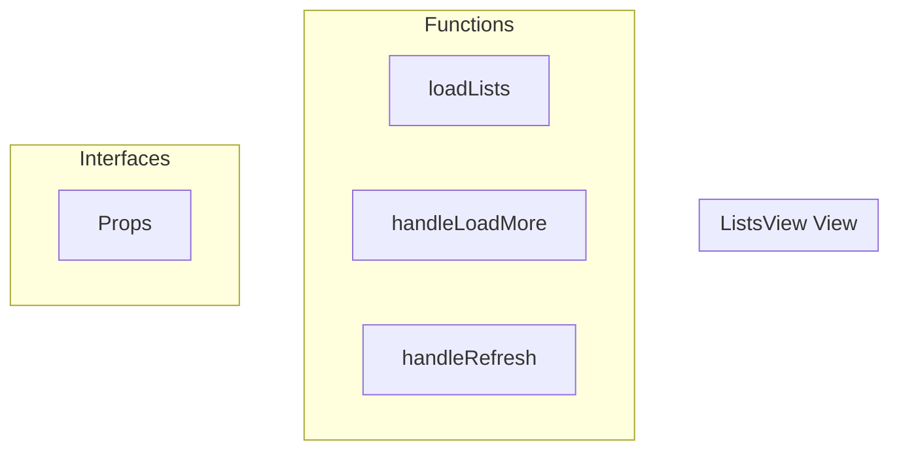

# ListsView View

**File:** `src/views/ListsView.vue`

## Overview


```mermaid
graph TB
    subgraph "ListsView View"
    end
    
    subgraph "Functions"
        FN_LOADLISTS[loadLists]
        FN_HANDLELOADMORE[handleLoadMore]
        FN_HANDLEREFRESH[handleRefresh]
    end
    
    subgraph "Interfaces"
        INT_PROPS[Props]
    end
```


## Functions

### `loadLists()`

No description available.

**Parameters:**
None

**Returns:** `Unknown`

```typescript
const loadLists = async () =>
```

### `handleLoadMore()`

No description available.

**Parameters:**
None

**Returns:** `Unknown`

```typescript
const handleLoadMore = async () =>
```

### `handleRefresh()`

No description available.

**Parameters:**
None

**Returns:** `Unknown`

```typescript
const handleRefresh = () =>
```


## Interfaces

### Props

No description available.

```typescript
interface Props {

  currentView: string
  viewType: string

}
```


## Vue Component

This is a Vue component file.


## Source Code Insights

**File Size:** 1757 characters
**Lines of Code:** 84
**Imports:** 4

## Usage Example

```typescript
import { ListsView } from '@/views/ListsView'

// Example usage
loadLists()
```

---

*This documentation was automatically generated from the source code.*