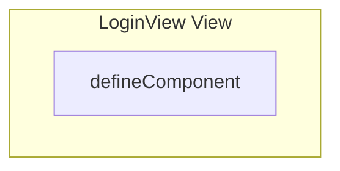

# LoginView View

**File:** `src/views/LoginView.vue`

## Overview




## Exports

- **defineComponent** - default export


## Vue Component

This is a Vue component file.


## Source Code Insights

**File Size:** 2168 characters
**Lines of Code:** 69
**Imports:** 7

## Usage Example

```typescript
import { defineComponent } from '@/views/LoginView'

// Example usage
// Use the exported functionality
```

---

*This documentation was automatically generated from the source code.*