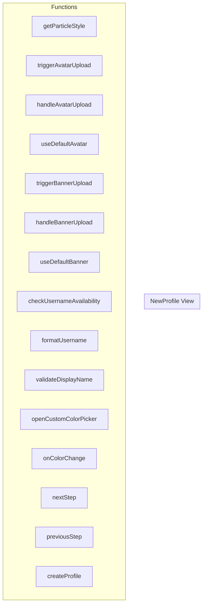

# NewProfile View

**File:** `src/views/NewProfile.vue`

## Overview




## Functions

### `getParticleStyle(index: number)`

No description available.

**Parameters:**
- `index: number`

**Returns:** `Unknown`

```typescript
const getParticleStyle = (index: number) =>
```

### `triggerAvatarUpload()`

No description available.

**Parameters:**
None

**Returns:** `Unknown`

```typescript
const triggerAvatarUpload = () =>
```

### `handleAvatarUpload(event: Event)`

No description available.

**Parameters:**
- `event: Event`

**Returns:** `Unknown`

```typescript
const handleAvatarUpload = (event: Event) =>
```

### `useDefaultAvatar()`

No description available.

**Parameters:**
None

**Returns:** `Unknown`

```typescript
const useDefaultAvatar = () =>
```

### `triggerBannerUpload()`

No description available.

**Parameters:**
None

**Returns:** `Unknown`

```typescript
const triggerBannerUpload = () =>
```

### `handleBannerUpload(event: Event)`

No description available.

**Parameters:**
- `event: Event`

**Returns:** `Unknown`

```typescript
const handleBannerUpload = (event: Event) =>
```

### `useDefaultBanner()`

No description available.

**Parameters:**
None

**Returns:** `Unknown`

```typescript
const useDefaultBanner = () =>
```

### `checkUsernameAvailability(usernameToCheck: string)`

No description available.

**Parameters:**
- `usernameToCheck: string`

**Returns:** `Unknown`

```typescript
const checkUsernameAvailability = async (usernameToCheck: string) =>
```

### `formatUsername(event: Event)`

No description available.

**Parameters:**
- `event: Event`

**Returns:** `Unknown`

```typescript
const formatUsername = (event: Event) =>
```

### `validateDisplayName()`

No description available.

**Parameters:**
None

**Returns:** `Unknown`

```typescript
const validateDisplayName = () =>
```

### `openCustomColorPicker()`

No description available.

**Parameters:**
None

**Returns:** `Unknown`

```typescript
const openCustomColorPicker = () =>
```

### `onColorChange()`

No description available.

**Parameters:**
None

**Returns:** `Unknown`

```typescript
const onColorChange = () =>
```

### `nextStep()`

No description available.

**Parameters:**
None

**Returns:** `Unknown`

```typescript
const nextStep = async () =>
```

### `previousStep()`

No description available.

**Parameters:**
None

**Returns:** `Unknown`

```typescript
const previousStep = () =>
```

### `createProfile()`

No description available.

**Parameters:**
None

**Returns:** `Unknown`

```typescript
const createProfile = async () =>
```


## Constants

### OAUTH_PROVIDERS

No description available.

```typescript
const OAUTH_PROVIDERS = ['google', 'github', 'twitch'] as const
```


## Vue Component

This is a Vue component file.


## Source Code Insights

**File Size:** 49072 characters
**Lines of Code:** 1930
**Imports:** 9

## Usage Example

```typescript
import { NewProfile } from '@/views/NewProfile'

// Example usage
getParticleStyle()
```

---

*This documentation was automatically generated from the source code.*