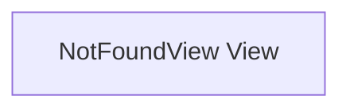

# NotFoundView View

**File:** `src/views/NotFoundView.vue`

## Overview




## Vue Component

This is a Vue component file.


## Source Code Insights

**File Size:** 138 characters
**Lines of Code:** 8
**Imports:** 1

## Usage Example

```typescript
import { NotFoundView } from '@/views/NotFoundView'

// Example usage
// Use the exported functionality
```

---

*This documentation was automatically generated from the source code.*