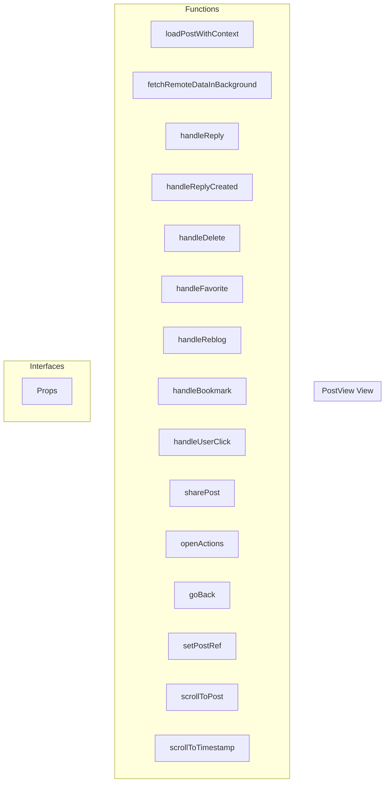

# PostView View

**File:** `src/views/PostView.vue`

## Overview




## Functions

### `loadPostWithContext()`

No description available.

**Parameters:**
None

**Returns:** `Unknown`

```typescript
const loadPostWithContext = async () =>
```

### `fetchRemoteDataInBackground(targetPost: TimelinePost)`

No description available.

**Parameters:**
- `targetPost: TimelinePost`

**Returns:** `Unknown`

```typescript
const fetchRemoteDataInBackground = async (targetPost: TimelinePost) =>
```

### `handleReply(post: TimelinePost)`

No description available.

**Parameters:**
- `post: TimelinePost`

**Returns:** `Unknown`

```typescript
const handleReply = (post: TimelinePost) =>
```

### `handleReplyCreated(newReply?: TimelinePost)`

No description available.

**Parameters:**
- `newReply?: TimelinePost`

**Returns:** `Unknown`

```typescript
const handleReplyCreated = async (newReply?: TimelinePost) =>
```

### `handleDelete(postId: string)`

No description available.

**Parameters:**
- `postId: string`

**Returns:** `Unknown`

```typescript
const handleDelete = async (postId: string) =>
```

### `handleFavorite(postId: string)`

No description available.

**Parameters:**
- `postId: string`

**Returns:** `Unknown`

```typescript
const handleFavorite = async (postId: string) =>
```

### `handleReblog(postId: string)`

No description available.

**Parameters:**
- `postId: string`

**Returns:** `Unknown`

```typescript
const handleReblog = async (postId: string) =>
```

### `handleBookmark(postId: string)`

No description available.

**Parameters:**
- `postId: string`

**Returns:** `Unknown`

```typescript
const handleBookmark = async (postId: string) =>
```

### `handleUserClick(userId: string)`

No description available.

**Parameters:**
- `userId: string`

**Returns:** `Unknown`

```typescript
const handleUserClick = (userId: string) =>
```

### `sharePost()`

No description available.

**Parameters:**
None

**Returns:** `Unknown`

```typescript
const sharePost = async () =>
```

### `openActions()`

No description available.

**Parameters:**
None

**Returns:** `Unknown`

```typescript
const openActions = () =>
```

### `goBack()`

No description available.

**Parameters:**
None

**Returns:** `Unknown`

```typescript
const goBack = () =>
```

### `setPostRef(postId: string, el: any)`

No description available.

**Parameters:**
- `postId: string`
- `el: any`

**Returns:** `Unknown`

```typescript
const setPostRef = (postId: string, el: any) =>
```

### `scrollToPost(postId: string)`

No description available.

**Parameters:**
- `postId: string`

**Returns:** `Unknown`

```typescript
const scrollToPost = (postId: string) =>
```

### `scrollToTimestamp(timestamp: number)`

No description available.

**Parameters:**
- `timestamp: number`

**Returns:** `Unknown`

```typescript
const scrollToTimestamp = (timestamp: number) =>
```


## Interfaces

### Props

No description available.

```typescript
interface Props {

  postId: string;
  contextType?: PostContextType;
  highlightReply?: string;
  timestamp?: number | null;

}
```


## Vue Component

This is a Vue component file.


## Source Code Insights

**File Size:** 19308 characters
**Lines of Code:** 717
**Imports:** 11

## Usage Example

```typescript
import { PostView } from '@/views/PostView'

// Example usage
loadPostWithContext()
```

---

*This documentation was automatically generated from the source code.*