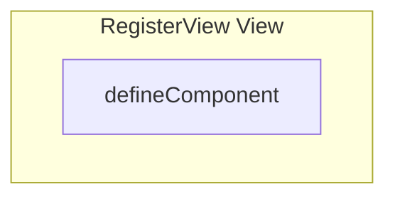

# RegisterView View

**File:** `src/views/RegisterView.vue`

## Overview




## Exports

- **defineComponent** - default export


## Vue Component

This is a Vue component file.


## Source Code Insights

**File Size:** 1165 characters
**Lines of Code:** 40
**Imports:** 2

## Usage Example

```typescript
import { defineComponent } from '@/views/RegisterView'

// Example usage
// Use the exported functionality
```

---

*This documentation was automatically generated from the source code.*