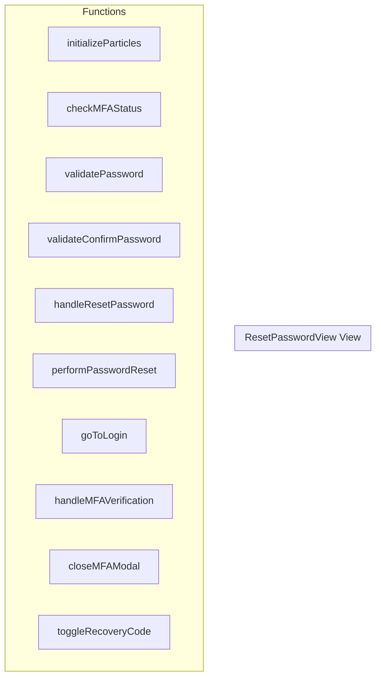

# ResetPasswordView View

**File:** `src/views/ResetPasswordView.vue`

## Overview




## Functions

### `initializeParticles()`

No description available.

**Parameters:**
None

**Returns:** `Unknown`

```typescript
const initializeParticles = () =>
```

### `checkMFAStatus()`

No description available.

**Parameters:**
None

**Returns:** `Unknown`

```typescript
const checkMFAStatus = async () =>
```

### `validatePassword()`

No description available.

**Parameters:**
None

**Returns:** `boolean`

```typescript
const validatePassword = (): boolean =>
```

### `validateConfirmPassword()`

No description available.

**Parameters:**
None

**Returns:** `boolean`

```typescript
const validateConfirmPassword = (): boolean =>
```

### `handleResetPassword()`

No description available.

**Parameters:**
None

**Returns:** `Unknown`

```typescript
const handleResetPassword = async () =>
```

### `performPasswordReset()`

No description available.

**Parameters:**
None

**Returns:** `Unknown`

```typescript
const performPasswordReset = async () =>
```

### `goToLogin()`

No description available.

**Parameters:**
None

**Returns:** `Unknown`

```typescript
const goToLogin = async () =>
```

### `handleMFAVerification()`

No description available.

**Parameters:**
None

**Returns:** `Unknown`

```typescript
const handleMFAVerification = async () =>
```

### `closeMFAModal()`

No description available.

**Parameters:**
None

**Returns:** `Unknown`

```typescript
const closeMFAModal = () =>
```

### `toggleRecoveryCode()`

No description available.

**Parameters:**
None

**Returns:** `Unknown`

```typescript
const toggleRecoveryCode = () =>
```


## Vue Component

This is a Vue component file.


## Source Code Insights

**File Size:** 32469 characters
**Lines of Code:** 1135
**Imports:** 6

## Usage Example

```typescript
import { ResetPasswordView } from '@/views/ResetPasswordView'

// Example usage
initializeParticles()
```

---

*This documentation was automatically generated from the source code.*