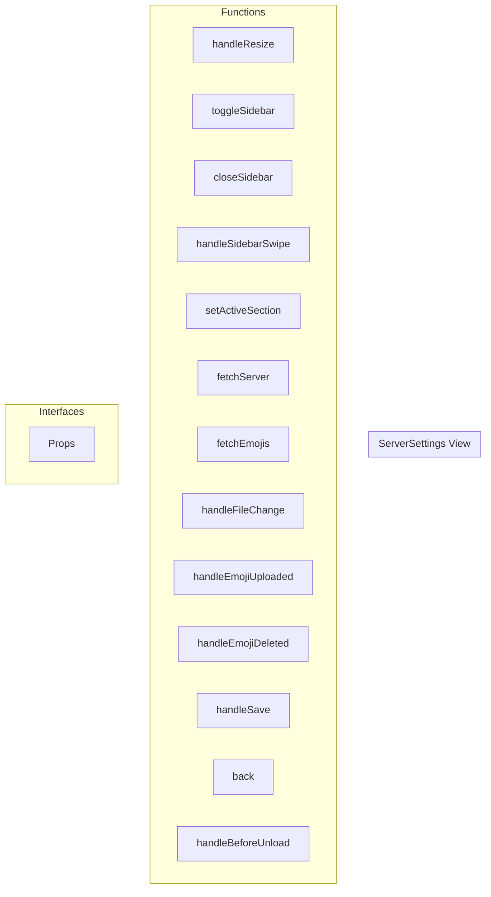

# ServerSettings View

**File:** `src/views/ServerSettings.vue`

## Overview




## Functions

### `handleResize()`

No description available.

**Parameters:**
None

**Returns:** `Unknown`

```typescript
const handleResize = () =>
```

### `toggleSidebar()`

No description available.

**Parameters:**
None

**Returns:** `Unknown`

```typescript
const toggleSidebar = () =>
```

### `closeSidebar()`

No description available.

**Parameters:**
None

**Returns:** `Unknown`

```typescript
const closeSidebar = () =>
```

### `handleSidebarSwipe()`

No description available.

**Parameters:**
None

**Returns:** `Unknown`

```typescript
const handleSidebarSwipe = () =>
```

### `setActiveSection(sectionId: string)`

No description available.

**Parameters:**
- `sectionId: string`

**Returns:** `Unknown`

```typescript
const setActiveSection = (sectionId: string) =>
```

### `fetchServer()`

No description available.

**Parameters:**
None

**Returns:** `Unknown`

```typescript
const fetchServer = async () =>
```

### `fetchEmojis()`

No description available.

**Parameters:**
None

**Returns:** `Unknown`

```typescript
const fetchEmojis = async () =>
```

### `handleFileChange(file: File | null)`

No description available.

**Parameters:**
- `file: File | null`

**Returns:** `Unknown`

```typescript
const handleFileChange = (file: File | null) =>
```

### `handleEmojiUploaded(newEmoji: Emoji)`

No description available.

**Parameters:**
- `newEmoji: Emoji`

**Returns:** `Unknown`

```typescript
const handleEmojiUploaded = (newEmoji: Emoji) =>
```

### `handleEmojiDeleted(emojiId: string)`

No description available.

**Parameters:**
- `emojiId: string`

**Returns:** `Unknown`

```typescript
const handleEmojiDeleted = (emojiId: string) =>
```

### `handleSave()`

No description available.

**Parameters:**
None

**Returns:** `Unknown`

```typescript
const handleSave = async () =>
```

### `back()`

No description available.

**Parameters:**
None

**Returns:** `Unknown`

```typescript
const back = () =>
```

### `handleBeforeUnload(e: BeforeUnloadEvent)`

No description available.

**Parameters:**
- `e: BeforeUnloadEvent`

**Returns:** `Unknown`

```typescript
const handleBeforeUnload = (e: BeforeUnloadEvent) =>
```


## Interfaces

### Props

No description available.

```typescript
interface Props {

  serverId: string

}
```


## Vue Component

This is a Vue component file.


## Source Code Insights

**File Size:** 19487 characters
**Lines of Code:** 779
**Imports:** 18

## Usage Example

```typescript
import { ServerSettings } from '@/views/ServerSettings'

// Example usage
handleResize()
```

---

*This documentation was automatically generated from the source code.*