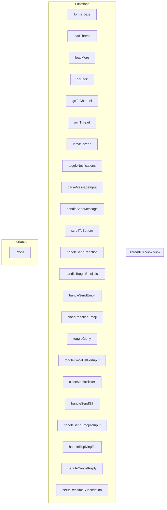

# ThreadFullView View

**File:** `src/views/ThreadFullView.vue`

## Overview




## Functions

### `formatDate(date: string | Date)`

No description available.

**Parameters:**
- `date: string | Date`

**Returns:** `Unknown`

```typescript
const formatDate = (date: string | Date) =>
```

### `loadThread()`

No description available.

**Parameters:**
None

**Returns:** `Unknown`

```typescript
const loadThread = async () =>
```

### `loadMore()`

No description available.

**Parameters:**
None

**Returns:** `Unknown`

```typescript
const loadMore = async () =>
```

### `goBack()`

No description available.

**Parameters:**
None

**Returns:** `Unknown`

```typescript
const goBack = () =>
```

### `goToChannel()`

No description available.

**Parameters:**
None

**Returns:** `Unknown`

```typescript
const goToChannel = () =>
```

### `joinThread()`

No description available.

**Parameters:**
None

**Returns:** `Unknown`

```typescript
const joinThread = async () =>
```

### `leaveThread()`

No description available.

**Parameters:**
None

**Returns:** `Unknown`

```typescript
const leaveThread = async () =>
```

### `toggleNotifications()`

No description available.

**Parameters:**
None

**Returns:** `Unknown`

```typescript
const toggleNotifications = () =>
```

### `parseMessageInput(input: string)`

No description available.

**Parameters:**
- `input: string`

**Returns:** `Promise&lt;MessagePart[]&gt;`

```typescript
const parseMessageInput = async (input: string): Promise<MessagePart[]> =>
```

### `handleSendMessage(content: string, files: FilePreviewData[] = [], replyMessageId?: string)`

No description available.

**Parameters:**
- `content: string`
- `files: FilePreviewData[] = []`
- `replyMessageId?: string`

**Returns:** `Unknown`

```typescript
const handleSendMessage = async (content: string, files: FilePreviewData[] = [], replyMessageId?: string) =>
```

### `scrollToBottom()`

No description available.

**Parameters:**
None

**Returns:** `Unknown`

```typescript
const scrollToBottom = () =>
```

### `handleSendReaction(messageId: string, emoji: Emoji)`

No description available.

**Parameters:**
- `messageId: string`
- `emoji: Emoji`

**Returns:** `Unknown`

```typescript
const handleSendReaction = async (messageId: string, emoji: Emoji) =>
```

### `handleToggleEmojiList(isReaction: boolean, message?: Message, triggerElement?: HTMLElement)`

No description available.

**Parameters:**
- `isReaction: boolean`
- `message?: Message`
- `triggerElement?: HTMLElement`

**Returns:** `Unknown`

```typescript
const handleToggleEmojiList = (isReaction: boolean, message?: Message, triggerElement?: HTMLElement) =>
```

### `handleSendEmoji(emoji: Emoji)`

No description available.

**Parameters:**
- `emoji: Emoji`

**Returns:** `Unknown`

```typescript
const handleSendEmoji = async (emoji: Emoji) =>
```

### `closeReactionEmoji()`

No description available.

**Parameters:**
None

**Returns:** `Unknown`

```typescript
const closeReactionEmoji = () =>
```

### `toggleGiphy()`

No description available.

**Parameters:**
None

**Returns:** `Unknown`

```typescript
const toggleGiphy = () =>
```

### `toggleEmojiListForInput(isReaction: boolean, message?: Message)`

No description available.

**Parameters:**
- `isReaction: boolean`
- `message?: Message`

**Returns:** `Unknown`

```typescript
const toggleEmojiListForInput = (isReaction: boolean, message?: Message) =>
```

### `closeMediaPicker()`

No description available.

**Parameters:**
None

**Returns:** `Unknown`

```typescript
const closeMediaPicker = () =>
```

### `handleSendGif(gif: Gif)`

No description available.

**Parameters:**
- `gif: Gif`

**Returns:** `Unknown`

```typescript
const handleSendGif = async (gif: Gif) =>
```

### `handleSendEmojiToInput(emoji: Emoji)`

No description available.

**Parameters:**
- `emoji: Emoji`

**Returns:** `Unknown`

```typescript
const handleSendEmojiToInput = (emoji: Emoji) =>
```

### `handleReplyingTo(messageId: string, displayName?: string)`

No description available.

**Parameters:**
- `messageId: string`
- `displayName?: string`

**Returns:** `Unknown`

```typescript
const handleReplyingTo = (messageId: string, displayName?: string) =>
```

### `handleCancelReply(value: string)`

No description available.

**Parameters:**
- `value: string`

**Returns:** `Unknown`

```typescript
const handleCancelReply = (value: string) =>
```

### `setupRealtimeSubscription()`

No description available.

**Parameters:**
None

**Returns:** `Unknown`

```typescript
const setupRealtimeSubscription = () =>
```


## Interfaces

### Props

No description available.

```typescript
interface Props {

  serverId: string
  threadId: string

}
```


## Vue Component

This is a Vue component file.


## Source Code Insights

**File Size:** 29466 characters
**Lines of Code:** 1061
**Imports:** 19

## Usage Example

```typescript
import { ThreadFullView } from '@/views/ThreadFullView'

// Example usage
formatDate()
```

---

*This documentation was automatically generated from the source code.*