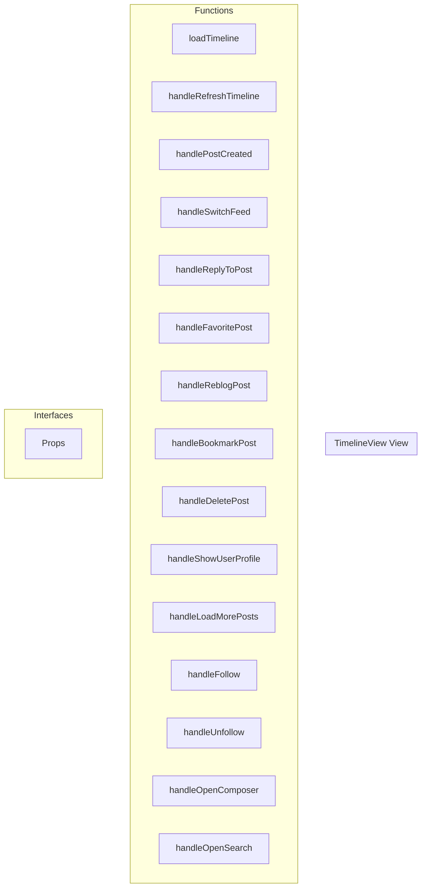

# TimelineView View

**File:** `src/views/TimelineView.vue`

## Overview




## Functions

### `loadTimeline()`

No description available.

**Parameters:**
None

**Returns:** `Unknown`

```typescript
const loadTimeline = async () =>
```

### `handleRefreshTimeline()`

No description available.

**Parameters:**
None

**Returns:** `Unknown`

```typescript
const handleRefreshTimeline = () =>
```

### `handlePostCreated()`

No description available.

**Parameters:**
None

**Returns:** `Unknown`

```typescript
const handlePostCreated = () =>
```

### `handleSwitchFeed(feed: string)`

No description available.

**Parameters:**
- `feed: string`

**Returns:** `Unknown`

```typescript
const handleSwitchFeed = (feed: string) =>
```

### `handleReplyToPost(post: TimelinePost)`

No description available.

**Parameters:**
- `post: TimelinePost`

**Returns:** `Unknown`

```typescript
const handleReplyToPost = (post: TimelinePost) =>
```

### `handleFavoritePost(post: TimelinePost)`

No description available.

**Parameters:**
- `post: TimelinePost`

**Returns:** `Unknown`

```typescript
const handleFavoritePost = async (post: TimelinePost) =>
```

### `handleReblogPost(post: TimelinePost)`

No description available.

**Parameters:**
- `post: TimelinePost`

**Returns:** `Unknown`

```typescript
const handleReblogPost = async (post: TimelinePost) =>
```

### `handleBookmarkPost(post: TimelinePost)`

No description available.

**Parameters:**
- `post: TimelinePost`

**Returns:** `Unknown`

```typescript
const handleBookmarkPost = async (post: TimelinePost) =>
```

### `handleDeletePost(post: TimelinePost)`

No description available.

**Parameters:**
- `post: TimelinePost`

**Returns:** `Unknown`

```typescript
const handleDeletePost = async (post: TimelinePost) =>
```

### `handleShowUserProfile(user: FederatedUser)`

No description available.

**Parameters:**
- `user: FederatedUser`

**Returns:** `Unknown`

```typescript
const handleShowUserProfile = (user: FederatedUser) =>
```

### `handleLoadMorePosts()`

No description available.

**Parameters:**
None

**Returns:** `Unknown`

```typescript
const handleLoadMorePosts = async () =>
```

### `handleFollow(user: FederatedUser)`

No description available.

**Parameters:**
- `user: FederatedUser`

**Returns:** `Unknown`

```typescript
const handleFollow = async (user: FederatedUser) =>
```

### `handleUnfollow(user: FederatedUser)`

No description available.

**Parameters:**
- `user: FederatedUser`

**Returns:** `Unknown`

```typescript
const handleUnfollow = async (user: FederatedUser) =>
```

### `handleOpenComposer()`

No description available.

**Parameters:**
None

**Returns:** `Unknown`

```typescript
const handleOpenComposer = () =>
```

### `handleOpenSearch()`

No description available.

**Parameters:**
None

**Returns:** `Unknown`

```typescript
const handleOpenSearch = () =>
```


## Interfaces

### Props

No description available.

```typescript
interface Props {

  currentView: string
  posts?: TimelinePost[]
  isLoadingFeed?: boolean
  hasMorePosts?: boolean
  viewType?: string

}
```


## Vue Component

This is a Vue component file.


## Source Code Insights

**File Size:** 8152 characters
**Lines of Code:** 308
**Imports:** 9

## Usage Example

```typescript
import { TimelineView } from '@/views/TimelineView'

// Example usage
loadTimeline()
```

---

*This documentation was automatically generated from the source code.*