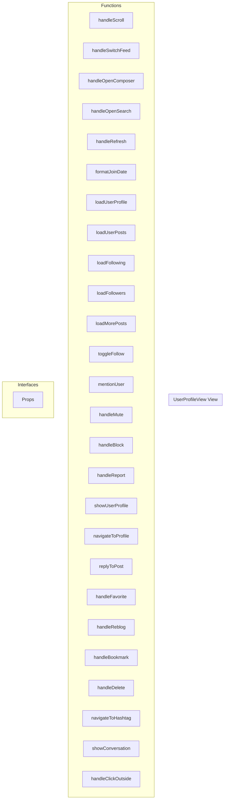

# UserProfileView View

**File:** `src/views/UserProfileView.vue`

## Overview




## Functions

### `handleScroll()`

No description available.

**Parameters:**
None

**Returns:** `Unknown`

```typescript
const handleScroll = () =>
```

### `handleSwitchFeed(feed: string)`

No description available.

**Parameters:**
- `feed: string`

**Returns:** `Unknown`

```typescript
const handleSwitchFeed = (feed: string) =>
```

### `handleOpenComposer()`

No description available.

**Parameters:**
None

**Returns:** `Unknown`

```typescript
const handleOpenComposer = () =>
```

### `handleOpenSearch()`

No description available.

**Parameters:**
None

**Returns:** `Unknown`

```typescript
const handleOpenSearch = () =>
```

### `handleRefresh()`

No description available.

**Parameters:**
None

**Returns:** `Unknown`

```typescript
const handleRefresh = () =>
```

### `formatJoinDate(dateString: string)`

No description available.

**Parameters:**
- `dateString: string`

**Returns:** `string`

```typescript
const formatJoinDate = (dateString: string): string =>
```

### `loadUserProfile(handle: string, forceRefresh: boolean = false)`

No description available.

**Parameters:**
- `handle: string`
- `forceRefresh: boolean = false`

**Returns:** `Unknown`

```typescript
const loadUserProfile = async (handle: string, forceRefresh: boolean = false) =>
```

### `loadUserPosts(retryCount = 0)`

No description available.

**Parameters:**
- `retryCount = 0`

**Returns:** `Unknown`

```typescript
const loadUserPosts = async (retryCount = 0) =>
```

### `loadFollowing()`

No description available.

**Parameters:**
None

**Returns:** `Unknown`

```typescript
const loadFollowing = async () =>
```

### `loadFollowers()`

No description available.

**Parameters:**
None

**Returns:** `Unknown`

```typescript
const loadFollowers = async () =>
```

### `loadMorePosts()`

No description available.

**Parameters:**
None

**Returns:** `Unknown`

```typescript
const loadMorePosts = async () =>
```

### `toggleFollow()`

No description available.

**Parameters:**
None

**Returns:** `Unknown`

```typescript
const toggleFollow = async () =>
```

### `mentionUser()`

No description available.

**Parameters:**
None

**Returns:** `Unknown`

```typescript
const mentionUser = () =>
```

### `handleMute()`

No description available.

**Parameters:**
None

**Returns:** `Unknown`

```typescript
const handleMute = async () =>
```

### `handleBlock()`

No description available.

**Parameters:**
None

**Returns:** `Unknown`

```typescript
const handleBlock = async () =>
```

### `handleReport()`

No description available.

**Parameters:**
None

**Returns:** `Unknown`

```typescript
const handleReport = () =>
```

### `showUserProfile(clickedUser: FederatedUser)`

No description available.

**Parameters:**
- `clickedUser: FederatedUser`

**Returns:** `Unknown`

```typescript
const showUserProfile = (clickedUser: FederatedUser) =>
```

### `navigateToProfile(clickedUser: FederatedUser)`

No description available.

**Parameters:**
- `clickedUser: FederatedUser`

**Returns:** `Unknown`

```typescript
const navigateToProfile = (clickedUser: FederatedUser) =>
```

### `replyToPost(post: TimelinePost)`

No description available.

**Parameters:**
- `post: TimelinePost`

**Returns:** `Unknown`

```typescript
const replyToPost = (post: TimelinePost) =>
```

### `handleFavorite(postId: string)`

No description available.

**Parameters:**
- `postId: string`

**Returns:** `Unknown`

```typescript
const handleFavorite = async (postId: string) =>
```

### `handleReblog(postId: string)`

No description available.

**Parameters:**
- `postId: string`

**Returns:** `Unknown`

```typescript
const handleReblog = async (postId: string) =>
```

### `handleBookmark(postId: string)`

No description available.

**Parameters:**
- `postId: string`

**Returns:** `Unknown`

```typescript
const handleBookmark = async (postId: string) =>
```

### `handleDelete(postId: string)`

No description available.

**Parameters:**
- `postId: string`

**Returns:** `Unknown`

```typescript
const handleDelete = async (postId: string) =>
```

### `navigateToHashtag(tag: string)`

No description available.

**Parameters:**
- `tag: string`

**Returns:** `Unknown`

```typescript
const navigateToHashtag = (tag: string) =>
```

### `showConversation(postId: string)`

No description available.

**Parameters:**
- `postId: string`

**Returns:** `Unknown`

```typescript
const showConversation = (postId: string) =>
```

### `handleClickOutside(event: Event)`

No description available.

**Parameters:**
- `event: Event`

**Returns:** `Unknown`

```typescript
const handleClickOutside = (event: Event) =>
```


## Interfaces

### Props

No description available.

```typescript
interface Props {

  profileHandle?: string;
  currentView?: string;
  viewType?: string;
  posts?: any[];
  isLoadingFeed?: boolean;
  hasMorePosts?: boolean;
  profileUser?: any;
  specialViewData?: any;
  hasMoreSpecialData?: boolean;
  postId?: string;

}
```


## Vue Component

This is a Vue component file.


## Source Code Insights

**File Size:** 48068 characters
**Lines of Code:** 1668
**Imports:** 21

## Usage Example

```typescript
import { UserProfileView } from '@/views/UserProfileView'

// Example usage
handleScroll()
```

---

*This documentation was automatically generated from the source code.*