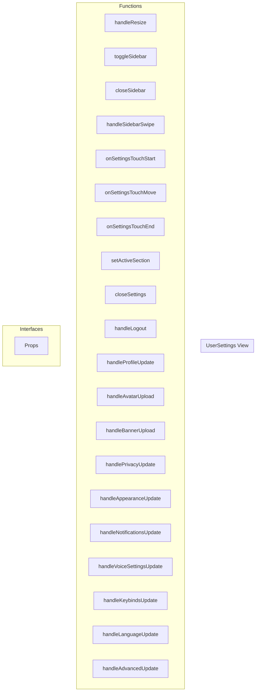

# UserSettings View

**File:** `src/views/UserSettings.vue`

## Overview




## Functions

### `handleResize()`

No description available.

**Parameters:**
None

**Returns:** `Unknown`

```typescript
const handleResize = () =>
```

### `toggleSidebar()`

No description available.

**Parameters:**
None

**Returns:** `Unknown`

```typescript
const toggleSidebar = () =>
```

### `closeSidebar()`

No description available.

**Parameters:**
None

**Returns:** `Unknown`

```typescript
const closeSidebar = () =>
```

### `handleSidebarSwipe()`

No description available.

**Parameters:**
None

**Returns:** `Unknown`

```typescript
const handleSidebarSwipe = () =>
```

### `onSettingsTouchStart(event: TouchEvent)`

No description available.

**Parameters:**
- `event: TouchEvent`

**Returns:** `Unknown`

```typescript
const onSettingsTouchStart = (event: TouchEvent) =>
```

### `onSettingsTouchMove(event: TouchEvent)`

No description available.

**Parameters:**
- `event: TouchEvent`

**Returns:** `Unknown`

```typescript
const onSettingsTouchMove = (event: TouchEvent) =>
```

### `onSettingsTouchEnd(event: TouchEvent)`

No description available.

**Parameters:**
- `event: TouchEvent`

**Returns:** `Unknown`

```typescript
const onSettingsTouchEnd = (event: TouchEvent) =>
```

### `setActiveSection(sectionId: string)`

No description available.

**Parameters:**
- `sectionId: string`

**Returns:** `Unknown`

```typescript
const setActiveSection = (sectionId: string) =>
```

### `closeSettings()`

No description available.

**Parameters:**
None

**Returns:** `Unknown`

```typescript
const closeSettings = () =>
```

### `handleLogout()`

No description available.

**Parameters:**
None

**Returns:** `Unknown`

```typescript
const handleLogout = async () =>
```

### `handleProfileUpdate(updatedProfile: Partial&lt;User&gt;)`

No description available.

**Parameters:**
- `updatedProfile: Partial&lt;User&gt;`

**Returns:** `Unknown`

```typescript
const handleProfileUpdate = async (updatedProfile: Partial<User>) =>
```

### `handleAvatarUpload(file: File)`

No description available.

**Parameters:**
- `file: File`

**Returns:** `Unknown`

```typescript
const handleAvatarUpload = async (file: File) =>
```

### `handleBannerUpload(file: File)`

No description available.

**Parameters:**
- `file: File`

**Returns:** `Unknown`

```typescript
const handleBannerUpload = async (file: File) =>
```

### `handlePrivacyUpdate(privacySettings: any)`

No description available.

**Parameters:**
- `privacySettings: any`

**Returns:** `Unknown`

```typescript
const handlePrivacyUpdate = async (privacySettings: any) =>
```

### `handleAppearanceUpdate(appearanceSettings: any)`

No description available.

**Parameters:**
- `appearanceSettings: any`

**Returns:** `Unknown`

```typescript
const handleAppearanceUpdate = async (appearanceSettings: any) =>
```

### `handleNotificationsUpdate(notificationSettings: any)`

No description available.

**Parameters:**
- `notificationSettings: any`

**Returns:** `Unknown`

```typescript
const handleNotificationsUpdate = async (notificationSettings: any) =>
```

### `handleVoiceSettingsUpdate(voiceSettings: any)`

No description available.

**Parameters:**
- `voiceSettings: any`

**Returns:** `Unknown`

```typescript
const handleVoiceSettingsUpdate = async (voiceSettings: any) =>
```

### `handleKeybindsUpdate(keybinds: any)`

No description available.

**Parameters:**
- `keybinds: any`

**Returns:** `Unknown`

```typescript
const handleKeybindsUpdate = async (keybinds: any) =>
```

### `handleLanguageUpdate(language: string)`

No description available.

**Parameters:**
- `language: string`

**Returns:** `Unknown`

```typescript
const handleLanguageUpdate = async (language: string) =>
```

### `handleAdvancedUpdate(advancedSettings: any)`

No description available.

**Parameters:**
- `advancedSettings: any`

**Returns:** `Unknown`

```typescript
const handleAdvancedUpdate = async (advancedSettings: any) =>
```


## Interfaces

### Props

No description available.

```typescript
interface Props {

  section?: string

}
```


## Vue Component

This is a Vue component file.


## Source Code Insights

**File Size:** 25470 characters
**Lines of Code:** 944
**Imports:** 36

## Usage Example

```typescript
import { UserSettings } from '@/views/UserSettings'

// Example usage
handleResize()
```

---

*This documentation was automatically generated from the source code.*