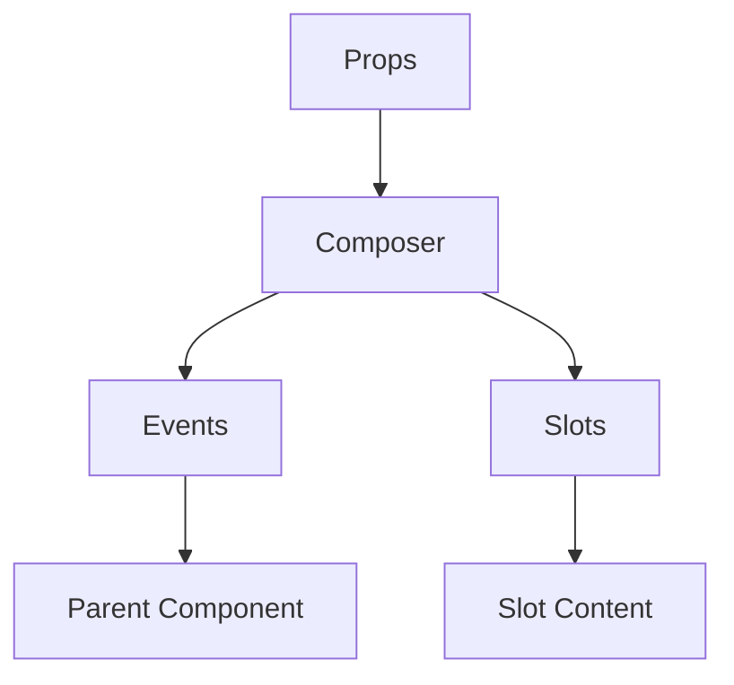

# Composer

A Vue component.

**File:** `src/components/activitypub/Composer.vue`

## Overview



## Props

| Name | Type | Default | Required | Description |
|------|------|---------|----------|-------------|
| `mode` | `union` | `undefined` | ✅ | No description |
| `type` | `union` | `undefined` | ✅ | No description |
| `replyToPost` | `TimelinePost` | `undefined` | ❌ | No description |
| `quotePost` | `TimelinePost` | `undefined` | ❌ | No description |
| `quoteAuthor` | `FederatedUser` | `undefined` | ❌ | No description |
| `isOpen` | `boolean` | `true` | ❌ | No description |
| `defaultVisibility` | `TSIndexedAccessType` | `'public'` | ❌ | No description |

### Props Details

#### `mode`

No description available.

- **Type:** `union`
- **Required:** Yes
- **Default:** `undefined`


#### `type`

No description available.

- **Type:** `union`
- **Required:** Yes
- **Default:** `undefined`


#### `replyToPost`

No description available.

- **Type:** `TimelinePost`
- **Required:** No
- **Default:** `undefined`


#### `quotePost`

No description available.

- **Type:** `TimelinePost`
- **Required:** No
- **Default:** `undefined`


#### `quoteAuthor`

No description available.

- **Type:** `FederatedUser`
- **Required:** No
- **Default:** `undefined`


#### `isOpen`

No description available.

- **Type:** `boolean`
- **Required:** No
- **Default:** `true`


#### `defaultVisibility`

No description available.

- **Type:** `TSIndexedAccessType`
- **Required:** No
- **Default:** `'public'`


## Events

| Name | Parameters | Description |
|------|------------|-------------|
| `close` | `unknown` | No description |
| `posted` | `any` | No description |

### Event Details

#### `close`

No description available.

**Parameters:** `unknown`


#### `posted`

No description available.

**Parameters:** `any`


## Slots

This component has no slots.

## Methods

This component exposes no public methods.

## Usage Example

```vue
<template>
  <Composer
    :mode="undefined"
    :type="undefined"
    @close="handleClose"
    @posted="handlePosted" />
</template>

<script setup lang="ts">
const handleClose = (data: unknown) => {
  // Handle close event
}

const handlePosted = (data: any) => {
  // Handle posted event
}
</script>
```


## File Location

`src/components/activitypub/Composer.vue`

---

*This documentation was automatically generated from the component source code.*