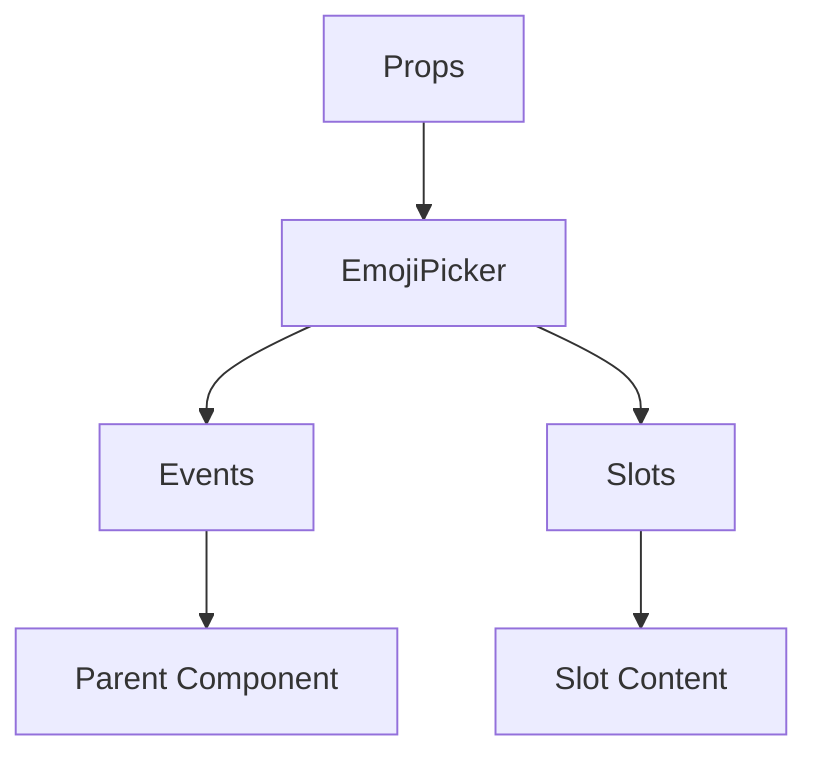

# EmojiPicker

A Vue component.

**File:** `src/components/activitypub/EmojiPicker.vue`

## Overview



## Props

| Name | Type | Default | Required | Description |
|------|------|---------|----------|-------------|
| `post` | `any` | `undefined` | ✅ | No description |

### Props Details

#### `post`

No description available.

- **Type:** `any`
- **Required:** Yes
- **Default:** `undefined`


## Events

| Name | Parameters | Description |
|------|------------|-------------|
| `close` | `unknown` | No description |
| `emojiSelected` | `{ content: string; name: string }` | No description |

### Event Details

#### `close`

No description available.

**Parameters:** `unknown`


#### `emojiSelected`

No description available.

**Parameters:** `{ content: string; name: string }`


## Slots

This component has no slots.

## Methods

This component exposes no public methods.

## Usage Example

```vue
<template>
  <EmojiPicker
    :post="undefined"
    @close="handleClose"
    @emojiSelected="handleEmojiSelected" />
</template>

<script setup lang="ts">
const handleClose = (data: unknown) => {
  // Handle close event
}

const handleEmojiSelected = (data: { content: string; name: string }) => {
  // Handle emojiSelected event
}
</script>
```


## File Location

`src/components/activitypub/EmojiPicker.vue`

---

*This documentation was automatically generated from the component source code.*