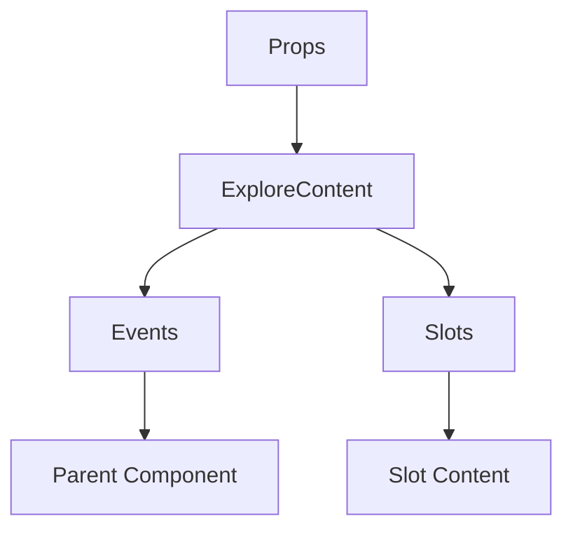

# ExploreContent

A Vue component.

**File:** `src/components/activitypub/ExploreContent.vue`

## Overview



## Props

| Name | Type | Default | Required | Description |
|------|------|---------|----------|-------------|
| `currentView` | `union` | `undefined` | ✅ | No description |

### Props Details

#### `currentView`

No description available.

- **Type:** `union`
- **Required:** Yes
- **Default:** `undefined`


## Events

| Name | Parameters | Description |
|------|------------|-------------|
| `reply-to-post` | `TimelinePost` | No description |
| `favorite-post` | `string` | No description |
| `reblog-post` | `string` | No description |
| `bookmark-post` | `string` | No description |
| `delete-post` | `string` | No description |
| `show-user-profile` | `FederatedUser` | No description |
| `show-conversation` | `TimelinePost` | No description |
| `switch-feed` | `string` | No description |
| `refresh-timeline` | `unknown` | No description |
| `follow-user` | `string` | No description |
| `unfollow-user` | `string` | No description |

### Event Details

#### `reply-to-post`

No description available.

**Parameters:** `TimelinePost`


#### `favorite-post`

No description available.

**Parameters:** `string`


#### `reblog-post`

No description available.

**Parameters:** `string`


#### `bookmark-post`

No description available.

**Parameters:** `string`


#### `delete-post`

No description available.

**Parameters:** `string`


#### `show-user-profile`

No description available.

**Parameters:** `FederatedUser`


#### `show-conversation`

No description available.

**Parameters:** `TimelinePost`


#### `switch-feed`

No description available.

**Parameters:** `string`


#### `refresh-timeline`

No description available.

**Parameters:** `unknown`


#### `follow-user`

No description available.

**Parameters:** `string`


#### `unfollow-user`

No description available.

**Parameters:** `string`


## Slots

This component has no slots.

## Methods

This component exposes no public methods.

## Usage Example

```vue
<template>
  <ExploreContent
    :currentView="undefined"
    @reply-to-post="handleReplyToPost"
    @favorite-post="handleFavoritePost"
    @reblog-post="handleReblogPost"
    @bookmark-post="handleBookmarkPost"
    @delete-post="handleDeletePost"
    @show-user-profile="handleShowUserProfile"
    @show-conversation="handleShowConversation"
    @switch-feed="handleSwitchFeed"
    @refresh-timeline="handleRefreshTimeline"
    @follow-user="handleFollowUser"
    @unfollow-user="handleUnfollowUser" />
</template>

<script setup lang="ts">
const handleReplyToPost = (data: TimelinePost) => {
  // Handle reply-to-post event
}

const handleFavoritePost = (data: string) => {
  // Handle favorite-post event
}

const handleReblogPost = (data: string) => {
  // Handle reblog-post event
}

const handleBookmarkPost = (data: string) => {
  // Handle bookmark-post event
}

const handleDeletePost = (data: string) => {
  // Handle delete-post event
}

const handleShowUserProfile = (data: FederatedUser) => {
  // Handle show-user-profile event
}

const handleShowConversation = (data: TimelinePost) => {
  // Handle show-conversation event
}

const handleSwitchFeed = (data: string) => {
  // Handle switch-feed event
}

const handleRefreshTimeline = (data: unknown) => {
  // Handle refresh-timeline event
}

const handleFollowUser = (data: string) => {
  // Handle follow-user event
}

const handleUnfollowUser = (data: string) => {
  // Handle unfollow-user event
}
</script>
```


## File Location

`src/components/activitypub/ExploreContent.vue`

---

*This documentation was automatically generated from the component source code.*