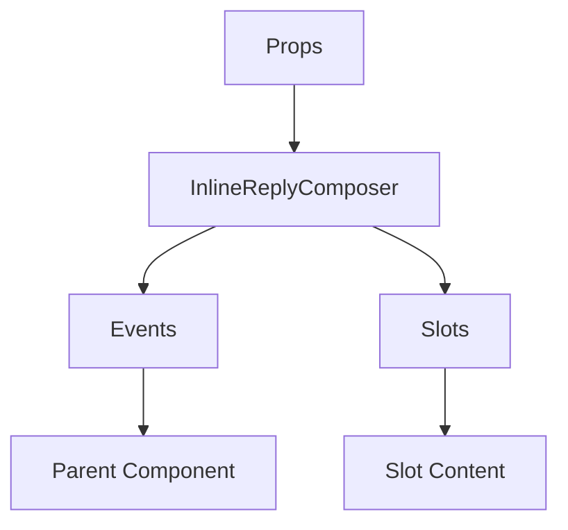

# InlineReplyComposer

No description available.

**File:** `src/components/activitypub/InlineReplyComposer.vue`

## Overview



## Props

| Name | Type | Default | Required | Description |
|------|------|---------|----------|-------------|
| `replyToPost` | `TimelinePost` | `undefined` | ✅ | No description |
| `isVisible` | `boolean` | `undefined` | ✅ | No description |

### Props Details

#### `replyToPost`

No description available.

- **Type:** `TimelinePost`
- **Required:** Yes
- **Default:** `undefined`


#### `isVisible`

No description available.

- **Type:** `boolean`
- **Required:** Yes
- **Default:** `undefined`


## Events

| Name | Parameters | Description |
|------|------------|-------------|
| `reply-sent` | any | No description |
| `cancel` | unknown | No description |
| `close` | unknown | No description |

### Event Details

#### `reply-sent`

No description available.

**Parameters:** `any`


#### `cancel`

No description available.

**Parameters:** `unknown`


#### `close`

No description available.

**Parameters:** `unknown`


## Slots

This component has no slots.

## Methods

This component exposes no public methods.

## Usage Example

```vue
<template>
  <InlineReplyComposer
    :replyToPost="undefined"
    :isVisible="true"
    @reply-sent="handleReply-sent"
    @cancel="handleCancel"
    @close="handleClose" />
</template>

<script setup lang="ts">
const handleReply-sent = (any) => {
  // Handle reply-sent event
}

const handleCancel = (data) => {
  // Handle cancel event
}

const handleClose = (data) => {
  // Handle close event
}
</script>
```


## File Location

`src/components/activitypub/InlineReplyComposer.vue`

---

*This documentation was automatically generated from the component source code.*