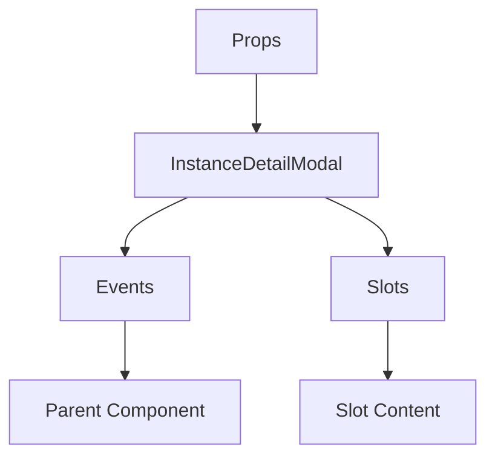

# InstanceDetailModal

A Vue component.

**File:** `src/components/activitypub/InstanceDetailModal.vue`

## Overview



## Props

| Name | Type | Default | Required | Description |
|------|------|---------|----------|-------------|
| `instance` | `FederatedInstance` | `undefined` | ✅ | No description |

### Props Details

#### `instance`

No description available.

- **Type:** `FederatedInstance`
- **Required:** Yes
- **Default:** `undefined`


## Events

| Name | Parameters | Description |
|------|------------|-------------|
| `close` | `unknown` | No description |
| `view-posts` | `FederatedInstance` | No description |

### Event Details

#### `close`

No description available.

**Parameters:** `unknown`


#### `view-posts`

No description available.

**Parameters:** `FederatedInstance`


## Slots

This component has no slots.

## Methods

This component exposes no public methods.

## Usage Example

```vue
<template>
  <InstanceDetailModal
    :instance="undefined"
    @close="handleClose"
    @view-posts="handleViewPosts" />
</template>

<script setup lang="ts">
const handleClose = (data: unknown) => {
  // Handle close event
}

const handleViewPosts = (data: FederatedInstance) => {
  // Handle view-posts event
}
</script>
```


## File Location

`src/components/activitypub/InstanceDetailModal.vue`

---

*This documentation was automatically generated from the component source code.*