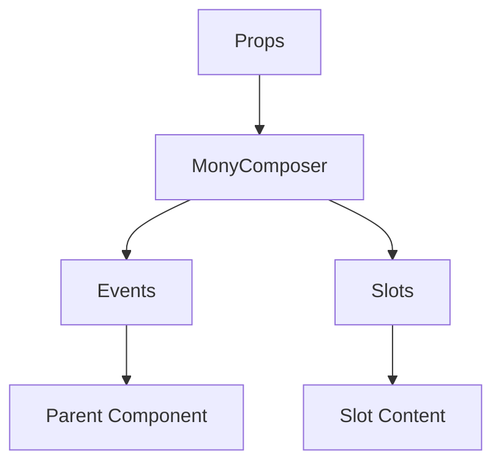

# MonyComposer

No description available.

**File:** `src/components/activitypub/MonyComposer.vue`

## Overview



## Props

| Name | Type | Default | Required | Description |
|------|------|---------|----------|-------------|
| `isOpen` | `boolean` | `undefined` | ✅ | No description |
| `composerState` | `PostComposerState` | `undefined` | ✅ | No description |
| `isPosting` | `boolean` | `undefined` | ✅ | No description |
| `replyToPost` | `any` | `undefined` | ❌ | No description |

### Props Details

#### `isOpen`

No description available.

- **Type:** `boolean`
- **Required:** Yes
- **Default:** `undefined`


#### `composerState`

No description available.

- **Type:** `PostComposerState`
- **Required:** Yes
- **Default:** `undefined`


#### `isPosting`

No description available.

- **Type:** `boolean`
- **Required:** Yes
- **Default:** `undefined`


#### `replyToPost`

No description available.

- **Type:** `any`
- **Required:** No
- **Default:** `undefined`


## Events

| Name | Parameters | Description |
|------|------------|-------------|
| `close` | unknown | No description |
| `submit` | unknown | No description |
| `update-content` | string | No description |
| `update-visibility` | TSIndexedAccessType | No description |

### Event Details

#### `close`

No description available.

**Parameters:** `unknown`


#### `submit`

No description available.

**Parameters:** `unknown`


#### `update-content`

No description available.

**Parameters:** `string`


#### `update-visibility`

No description available.

**Parameters:** `TSIndexedAccessType`


## Slots

This component has no slots.

## Methods

This component exposes no public methods.

## Usage Example

```vue
<template>
  <MonyComposer
    :isOpen="true"
    :composerState="undefined"
    :isPosting="true"
    @close="handleClose"
    @submit="handleSubmit"
    @update-content="handleUpdate-content"
    @update-visibility="handleUpdate-visibility" />
</template>

<script setup lang="ts">
const handleClose = (data) => {
  // Handle close event
}

const handleSubmit = (data) => {
  // Handle submit event
}

const handleUpdate-content = (string) => {
  // Handle update-content event
}

const handleUpdate-visibility = (TSIndexedAccessType) => {
  // Handle update-visibility event
}
</script>
```


## File Location

`src/components/activitypub/MonyComposer.vue`

---

*This documentation was automatically generated from the component source code.*