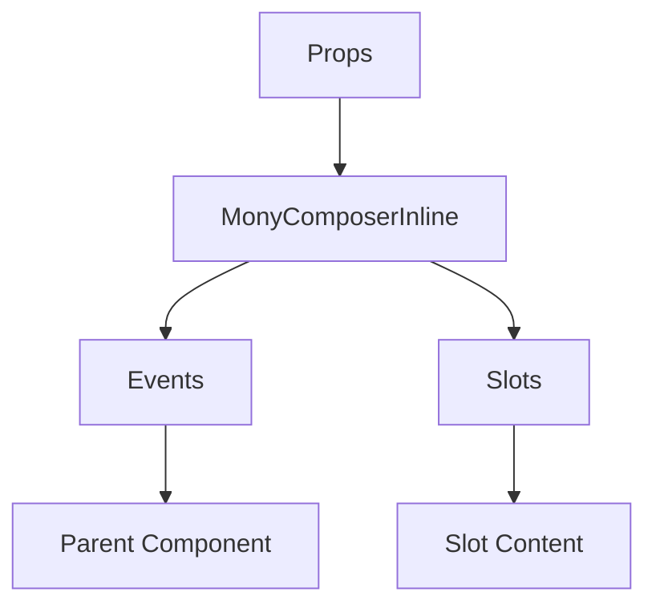

# MonyComposerInline

No description available.

**File:** `src/components/activitypub/MonyComposerInline.vue`

## Overview



## Props

This component has no props.

## Events

| Name | Parameters | Description |
|------|------------|-------------|
| `post-created` | any | No description |

### Event Details

#### `post-created`

No description available.

**Parameters:** `any`


## Slots

This component has no slots.

## Methods

This component exposes no public methods.

## Usage Example

```vue
<template>
  <MonyComposerInline
    @post-created="handlePost-created" />
</template>

<script setup lang="ts">
const handlePost-created = (any) => {
  // Handle post-created event
}
</script>
```


## File Location

`src/components/activitypub/MonyComposerInline.vue`

---

*This documentation was automatically generated from the component source code.*