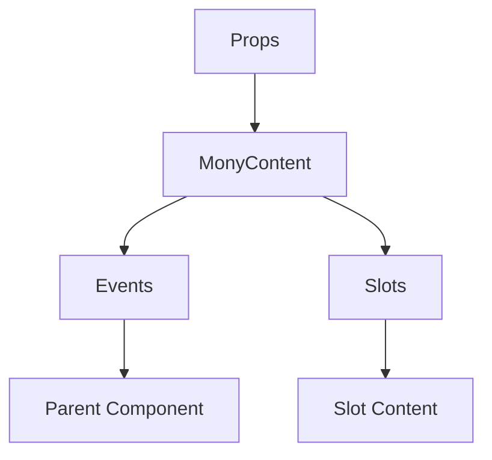

# MonyContent

A Vue component.

**File:** `src/components/activitypub/MonyContent.vue`

## Overview



## Props

| Name | Type | Default | Required | Description |
|------|------|---------|----------|-------------|
| `content` | `union` | `undefined` | ✅ | No description |
| `isPreview` | `boolean` | `undefined` | ❌ | No description |
| `previewLength` | `number` | `undefined` | ❌ | No description |

### Props Details

#### `content`

No description available.

- **Type:** `union`
- **Required:** Yes
- **Default:** `undefined`


#### `isPreview`

No description available.

- **Type:** `boolean`
- **Required:** No
- **Default:** `undefined`


#### `previewLength`

No description available.

- **Type:** `number`
- **Required:** No
- **Default:** `undefined`


## Events

| Name | Parameters | Description |
|------|------------|-------------|
| `user-mention-click` | `string` | No description |
| `hashtag-click` | `string` | No description |
| `image-click` | `string` | No description |

### Event Details

#### `user-mention-click`

No description available.

**Parameters:** `string`


#### `hashtag-click`

No description available.

**Parameters:** `string`


#### `image-click`

No description available.

**Parameters:** `string`


## Slots

This component has no slots.

## Methods

This component exposes no public methods.

## Usage Example

```vue
<template>
  <MonyContent
    :content="undefined"
    @user-mention-click="handleUserMentionClick"
    @hashtag-click="handleHashtagClick"
    @image-click="handleImageClick" />
</template>

<script setup lang="ts">
const handleUserMentionClick = (data: string) => {
  // Handle user-mention-click event
}

const handleHashtagClick = (data: string) => {
  // Handle hashtag-click event
}

const handleImageClick = (data: string) => {
  // Handle image-click event
}
</script>
```


## File Location

`src/components/activitypub/MonyContent.vue`

---

*This documentation was automatically generated from the component source code.*