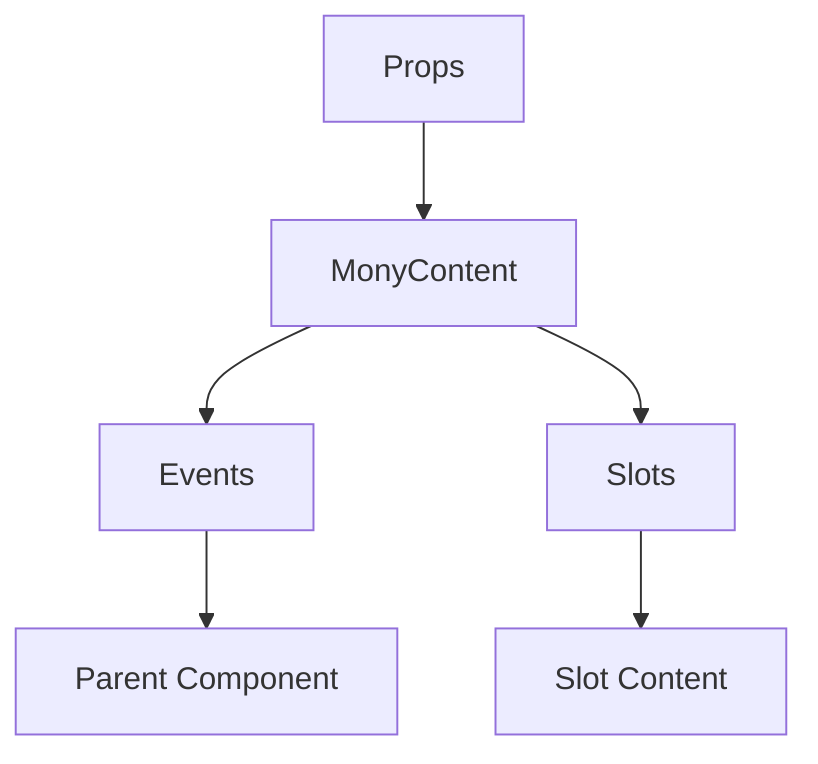

# MonyContent

No description available.

**File:** `src/components/activitypub/MonyContent.vue`

## Overview


```mermaid
graph TB
    PROPS[Props] --> COMPONENT[MonyContent]
    COMPONENT --> EVENTS[Events]
    COMPONENT --> SLOTS[Slots]
    EVENTS --> PARENT[Parent Component]
    SLOTS --> CONTENT[Slot Content]
```

## Props

| Name | Type | Default | Required | Description |
|------|------|---------|----------|-------------|
| `content` | `union` | `undefined` | ✅ | No description |

### Props Details

#### `content`

No description available.

- **Type:** `union`
- **Required:** Yes
- **Default:** `undefined`


## Events

| Name | Parameters | Description |
|------|------------|-------------|
| `user-mention-click` | string | No description |
| `hashtag-click` | string | No description |

### Event Details

#### `user-mention-click`

No description available.

**Parameters:** `string`


#### `hashtag-click`

No description available.

**Parameters:** `string`


## Slots

This component has no slots.

## Methods

This component exposes no public methods.

## Usage Example

```vue
<template>
  <MonyContent
    :content="undefined"
    @user-mention-click="handleUser-mention-click"
    @hashtag-click="handleHashtag-click" />
</template>

<script setup lang="ts">
const handleUser-mention-click = (string) => {
  // Handle user-mention-click event
}

const handleHashtag-click = (string) => {
  // Handle hashtag-click event
}
</script>
```


## File Location

`src/components/activitypub/MonyContent.vue`

---

*This documentation was automatically generated from the component source code.*