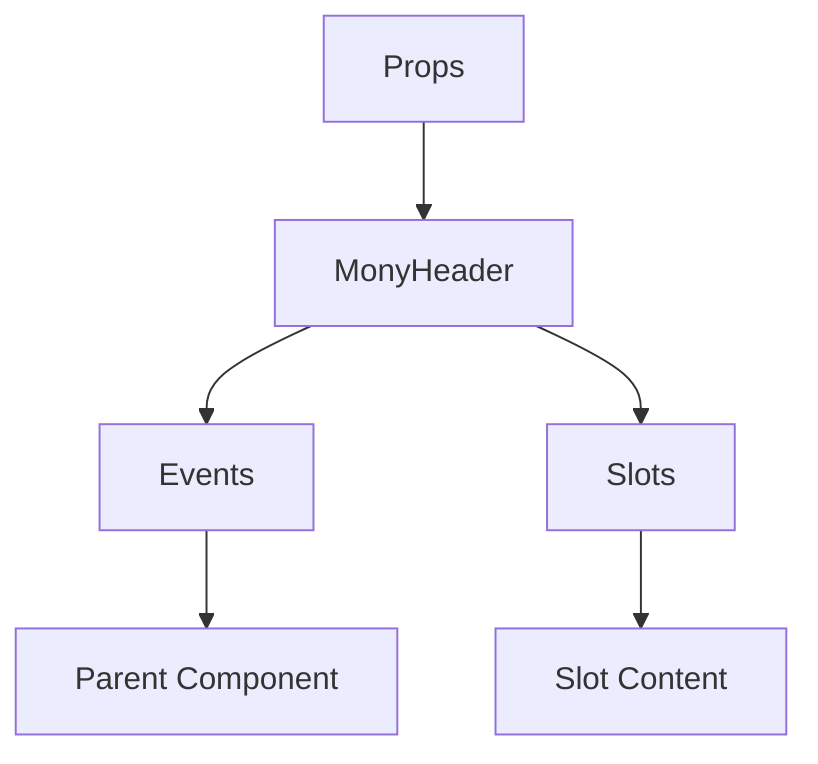

# MonyHeader

A Vue component.

**File:** `src/components/activitypub/MonyHeader.vue`

## Overview



## Props

| Name | Type | Default | Required | Description |
|------|------|---------|----------|-------------|
| `currentView` | `string` | `'home'` | ❌ | No description |
| `isMobile` | `boolean` | `false` | ❌ | No description |
| `rightSidebarOpen` | `boolean` | `false` | ❌ | No description |

### Props Details

#### `currentView`

No description available.

- **Type:** `string`
- **Required:** No
- **Default:** `'home'`


#### `isMobile`

No description available.

- **Type:** `boolean`
- **Required:** No
- **Default:** `false`


#### `rightSidebarOpen`

No description available.

- **Type:** `boolean`
- **Required:** No
- **Default:** `false`


## Events

| Name | Parameters | Description |
|------|------------|-------------|
| `toggle-left-sidebar` | `unknown` | No description |
| `switch-feed` | `string` | No description |
| `open-search` | `unknown` | No description |
| `open-composer` | `unknown` | No description |
| `refresh-timeline` | `unknown` | No description |
| `toggle-right-sidebar` | `unknown` | No description |

### Event Details

#### `toggle-left-sidebar`

No description available.

**Parameters:** `unknown`


#### `switch-feed`

No description available.

**Parameters:** `string`


#### `open-search`

No description available.

**Parameters:** `unknown`


#### `open-composer`

No description available.

**Parameters:** `unknown`


#### `refresh-timeline`

No description available.

**Parameters:** `unknown`


#### `toggle-right-sidebar`

No description available.

**Parameters:** `unknown`


## Slots

This component has no slots.

## Methods

This component exposes no public methods.

## Usage Example

```vue
<template>
  <MonyHeader
    
    @toggle-left-sidebar="handleToggleLeftSidebar"
    @switch-feed="handleSwitchFeed"
    @open-search="handleOpenSearch"
    @open-composer="handleOpenComposer"
    @refresh-timeline="handleRefreshTimeline"
    @toggle-right-sidebar="handleToggleRightSidebar" />
</template>

<script setup lang="ts">
const handleToggleLeftSidebar = (data: unknown) => {
  // Handle toggle-left-sidebar event
}

const handleSwitchFeed = (data: string) => {
  // Handle switch-feed event
}

const handleOpenSearch = (data: unknown) => {
  // Handle open-search event
}

const handleOpenComposer = (data: unknown) => {
  // Handle open-composer event
}

const handleRefreshTimeline = (data: unknown) => {
  // Handle refresh-timeline event
}

const handleToggleRightSidebar = (data: unknown) => {
  // Handle toggle-right-sidebar event
}
</script>
```


## File Location

`src/components/activitypub/MonyHeader.vue`

---

*This documentation was automatically generated from the component source code.*