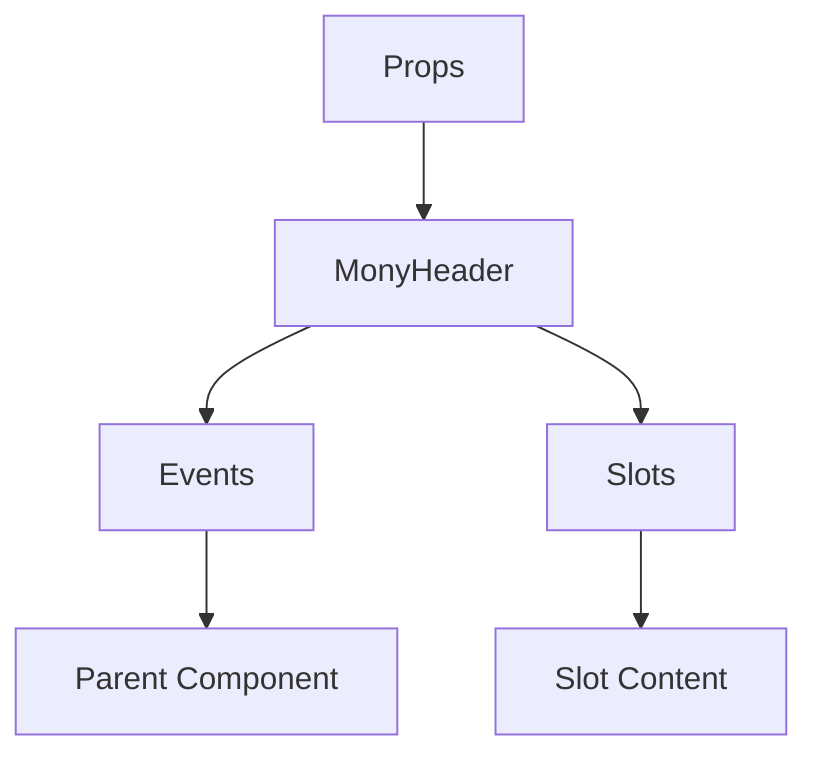

# MonyHeader

No description available.

**File:** `src/components/activitypub/MonyHeader.vue`

## Overview


```mermaid
graph TB
    PROPS[Props] --> COMPONENT[MonyHeader]
    COMPONENT --> EVENTS[Events]
    COMPONENT --> SLOTS[Slots]
    EVENTS --> PARENT[Parent Component]
    SLOTS --> CONTENT[Slot Content]
```

## Props

| Name | Type | Default | Required | Description |
|------|------|---------|----------|-------------|
| `currentView` | `string` | `'home'` | ❌ | No description |
| `isMobile` | `boolean` | `false` | ❌ | No description |
| `rightSidebarOpen` | `boolean` | `false` | ❌ | No description |

### Props Details

#### `currentView`

No description available.

- **Type:** `string`
- **Required:** No
- **Default:** `'home'`


#### `isMobile`

No description available.

- **Type:** `boolean`
- **Required:** No
- **Default:** `false`


#### `rightSidebarOpen`

No description available.

- **Type:** `boolean`
- **Required:** No
- **Default:** `false`


## Events

| Name | Parameters | Description |
|------|------------|-------------|
| `toggle-left-sidebar` | unknown | No description |
| `switch-feed` | string | No description |
| `open-search` | unknown | No description |
| `open-composer` | unknown | No description |
| `refresh-timeline` | unknown | No description |
| `toggle-right-sidebar` | unknown | No description |

### Event Details

#### `toggle-left-sidebar`

No description available.

**Parameters:** `unknown`


#### `switch-feed`

No description available.

**Parameters:** `string`


#### `open-search`

No description available.

**Parameters:** `unknown`


#### `open-composer`

No description available.

**Parameters:** `unknown`


#### `refresh-timeline`

No description available.

**Parameters:** `unknown`


#### `toggle-right-sidebar`

No description available.

**Parameters:** `unknown`


## Slots

This component has no slots.

## Methods

This component exposes no public methods.

## Usage Example

```vue
<template>
  <MonyHeader
    
    @toggle-left-sidebar="handleToggle-left-sidebar"
    @switch-feed="handleSwitch-feed"
    @open-search="handleOpen-search"
    @open-composer="handleOpen-composer"
    @refresh-timeline="handleRefresh-timeline"
    @toggle-right-sidebar="handleToggle-right-sidebar" />
</template>

<script setup lang="ts">
const handleToggle-left-sidebar = (data) => {
  // Handle toggle-left-sidebar event
}

const handleSwitch-feed = (string) => {
  // Handle switch-feed event
}

const handleOpen-search = (data) => {
  // Handle open-search event
}

const handleOpen-composer = (data) => {
  // Handle open-composer event
}

const handleRefresh-timeline = (data) => {
  // Handle refresh-timeline event
}

const handleToggle-right-sidebar = (data) => {
  // Handle toggle-right-sidebar event
}
</script>
```


## File Location

`src/components/activitypub/MonyHeader.vue`

---

*This documentation was automatically generated from the component source code.*