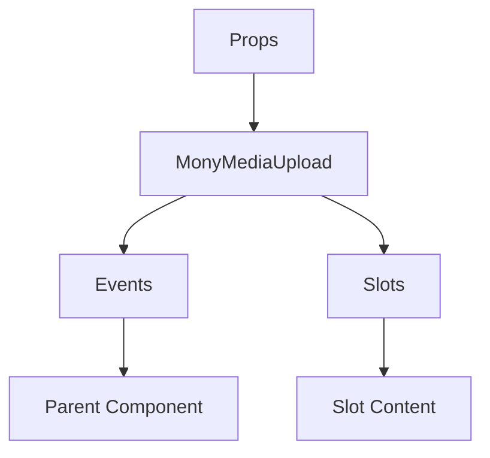

# MonyMediaUpload

A Vue component.

**File:** `src/components/activitypub/MonyMediaUpload.vue`

## Overview



## Props

| Name | Type | Default | Required | Description |
|------|------|---------|----------|-------------|
| `attachments` | `Array` | `undefined` | ✅ | No description |

### Props Details

#### `attachments`

No description available.

- **Type:** `Array`
- **Required:** Yes
- **Default:** `undefined`


## Events

| Name | Parameters | Description |
|------|------------|-------------|
| `remove` | `number` | No description |
| `update-description` | `number` | No description |

### Event Details

#### `remove`

No description available.

**Parameters:** `number`


#### `update-description`

No description available.

**Parameters:** `number`


## Slots

This component has no slots.

## Methods

This component exposes no public methods.

## Usage Example

```vue
<template>
  <MonyMediaUpload
    :attachments="[]"
    @remove="handleRemove"
    @update-description="handleUpdateDescription" />
</template>

<script setup lang="ts">
const handleRemove = (data: number) => {
  // Handle remove event
}

const handleUpdateDescription = (data: number) => {
  // Handle update-description event
}
</script>
```


## File Location

`src/components/activitypub/MonyMediaUpload.vue`

---

*This documentation was automatically generated from the component source code.*