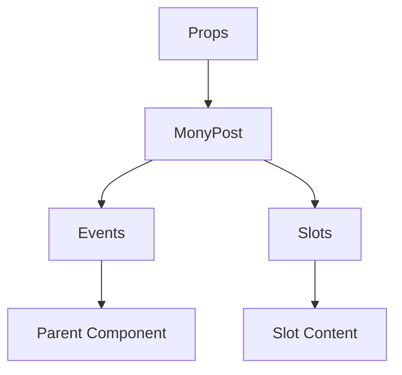

# MonyPost

A Vue component.

**File:** `src/components/activitypub/MonyPost.vue`

## Overview



## Props

| Name | Type | Default | Required | Description |
|------|------|---------|----------|-------------|
| `post` | `TimelinePost` | `undefined` | ✅ | No description |
| `hideReplyContext` | `boolean` | `false` | ❌ | No description |
| `isInThread` | `boolean` | `false` | ❌ | No description |

### Props Details

#### `post`

No description available.

- **Type:** `TimelinePost`
- **Required:** Yes
- **Default:** `undefined`


#### `hideReplyContext`

No description available.

- **Type:** `boolean`
- **Required:** No
- **Default:** `false`


#### `isInThread`

No description available.

- **Type:** `boolean`
- **Required:** No
- **Default:** `false`


## Events

| Name | Parameters | Description |
|------|------------|-------------|
| `reply` | `TimelinePost` | No description |
| `delete` | `string` | No description |
| `edit` | `string` | No description |
| `click` | `TimelinePost` | No description |
| `user-mention-click` | `string` | No description |
| `hashtag-click` | `string` | No description |
| `user-click` | `any` | No description |
| `show-conversation` | `string` | No description |
| `refresh` | `string` | No description |

### Event Details

#### `reply`

No description available.

**Parameters:** `TimelinePost`


#### `delete`

No description available.

**Parameters:** `string`


#### `edit`

No description available.

**Parameters:** `string`


#### `click`

No description available.

**Parameters:** `TimelinePost`


#### `user-mention-click`

No description available.

**Parameters:** `string`


#### `hashtag-click`

No description available.

**Parameters:** `string`


#### `user-click`

No description available.

**Parameters:** `any`


#### `show-conversation`

No description available.

**Parameters:** `string`


#### `refresh`

No description available.

**Parameters:** `string`


## Slots

This component has no slots.

## Methods

This component exposes no public methods.

## Usage Example

```vue
<template>
  <MonyPost
    :post="undefined"
    @reply="handleReply"
    @delete="handleDelete"
    @edit="handleEdit"
    @click="handleClick"
    @user-mention-click="handleUserMentionClick"
    @hashtag-click="handleHashtagClick"
    @user-click="handleUserClick"
    @show-conversation="handleShowConversation"
    @refresh="handleRefresh" />
</template>

<script setup lang="ts">
const handleReply = (data: TimelinePost) => {
  // Handle reply event
}

const handleDelete = (data: string) => {
  // Handle delete event
}

const handleEdit = (data: string) => {
  // Handle edit event
}

const handleClick = (data: TimelinePost) => {
  // Handle click event
}

const handleUserMentionClick = (data: string) => {
  // Handle user-mention-click event
}

const handleHashtagClick = (data: string) => {
  // Handle hashtag-click event
}

const handleUserClick = (data: any) => {
  // Handle user-click event
}

const handleShowConversation = (data: string) => {
  // Handle show-conversation event
}

const handleRefresh = (data: string) => {
  // Handle refresh event
}
</script>
```


## File Location

`src/components/activitypub/MonyPost.vue`

---

*This documentation was automatically generated from the component source code.*