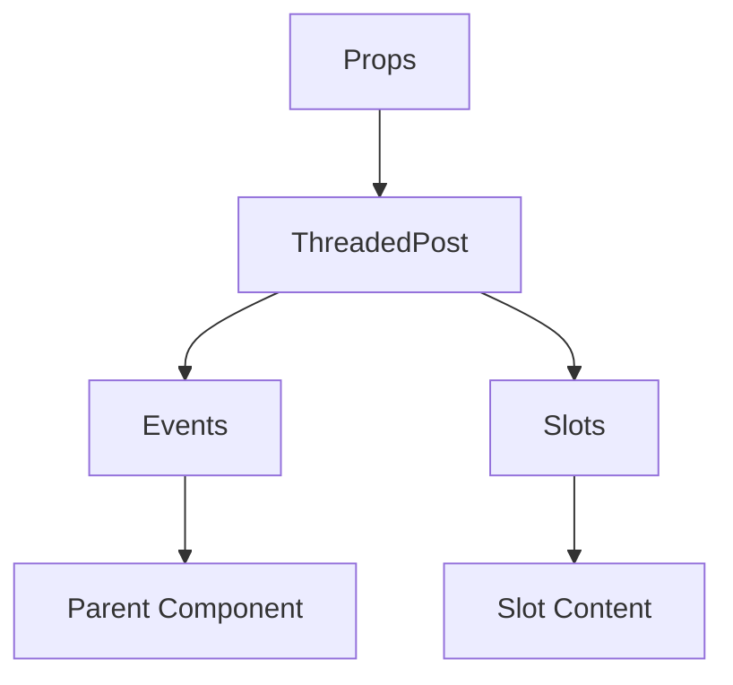

# ThreadedPost

A Vue component.

**File:** `src/components/activitypub/ThreadedPost.vue`

## Overview



## Props

| Name | Type | Default | Required | Description |
|------|------|---------|----------|-------------|
| `post` | `ActivityPubPost` | `undefined` | ✅ | No description |
| `threadDepth` | `number` | `undefined` | ✅ | No description |
| `maxDepth` | `number` | `undefined` | ✅ | No description |
| `highlightedPostId` | `string` | `undefined` | ❌ | No description |
| `replyingToPostId` | `string` | `undefined` | ❌ | No description |
| `showReplyComposer` | `boolean` | `undefined` | ✅ | No description |

### Props Details

#### `post`

No description available.

- **Type:** `ActivityPubPost`
- **Required:** Yes
- **Default:** `undefined`


#### `threadDepth`

No description available.

- **Type:** `number`
- **Required:** Yes
- **Default:** `undefined`


#### `maxDepth`

No description available.

- **Type:** `number`
- **Required:** Yes
- **Default:** `undefined`


#### `highlightedPostId`

No description available.

- **Type:** `string`
- **Required:** No
- **Default:** `undefined`


#### `replyingToPostId`

No description available.

- **Type:** `string`
- **Required:** No
- **Default:** `undefined`


#### `showReplyComposer`

No description available.

- **Type:** `boolean`
- **Required:** Yes
- **Default:** `undefined`


## Events

| Name | Parameters | Description |
|------|------------|-------------|
| `favorite` | `string` | No description |
| `reblog` | `string` | No description |
| `bookmark` | `string` | No description |
| `delete` | `string` | No description |
| `user-click` | `any` | No description |
| `reply` | `ActivityPubPost` | No description |
| `post-created` | `ActivityPubPost` | No description |
| `cancel-reply` | `unknown` | No description |
| `ref` | `string` | No description |

### Event Details

#### `favorite`

No description available.

**Parameters:** `string`


#### `reblog`

No description available.

**Parameters:** `string`


#### `bookmark`

No description available.

**Parameters:** `string`


#### `delete`

No description available.

**Parameters:** `string`


#### `user-click`

No description available.

**Parameters:** `any`


#### `reply`

No description available.

**Parameters:** `ActivityPubPost`


#### `post-created`

No description available.

**Parameters:** `ActivityPubPost`


#### `cancel-reply`

No description available.

**Parameters:** `unknown`


#### `ref`

No description available.

**Parameters:** `string`


## Slots

This component has no slots.

## Methods

This component exposes no public methods.

## Usage Example

```vue
<template>
  <ThreadedPost
    :post="undefined"
    :threadDepth="42"
    :maxDepth="42"
    :showReplyComposer="true"
    @favorite="handleFavorite"
    @reblog="handleReblog"
    @bookmark="handleBookmark"
    @delete="handleDelete"
    @user-click="handleUserClick"
    @reply="handleReply"
    @post-created="handlePostCreated"
    @cancel-reply="handleCancelReply"
    @ref="handleRef" />
</template>

<script setup lang="ts">
const handleFavorite = (data: string) => {
  // Handle favorite event
}

const handleReblog = (data: string) => {
  // Handle reblog event
}

const handleBookmark = (data: string) => {
  // Handle bookmark event
}

const handleDelete = (data: string) => {
  // Handle delete event
}

const handleUserClick = (data: any) => {
  // Handle user-click event
}

const handleReply = (data: ActivityPubPost) => {
  // Handle reply event
}

const handlePostCreated = (data: ActivityPubPost) => {
  // Handle post-created event
}

const handleCancelReply = (data: unknown) => {
  // Handle cancel-reply event
}

const handleRef = (data: string) => {
  // Handle ref event
}
</script>
```


## File Location

`src/components/activitypub/ThreadedPost.vue`

---

*This documentation was automatically generated from the component source code.*