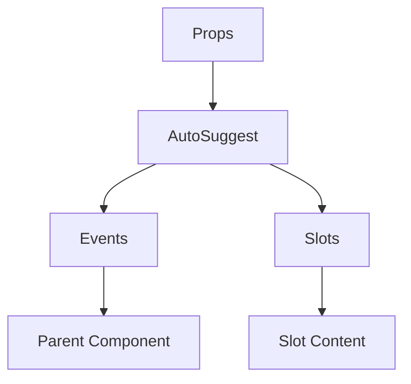

# AutoSuggest

A Vue component.

**File:** `src/components/AutoSuggest.vue`

## Overview



## Props

| Name | Type | Default | Required | Description |
|------|------|---------|----------|-------------|
| `isVisible` | `boolean` | `false` | ❌ | No description |
| `suggestions` | `Array` | `() => []` | ❌ | No description |
| `position` | `SuggestionPosition` | `() => ({ x: 0, y: 0 })` | ❌ | No description |
| `selectedIndex` | `number` | `0` | ❌ | No description |
| `headerText` | `string` | `''` | ❌ | No description |
| `maxHeight` | `number` | `200` | ❌ | No description |

### Props Details

#### `isVisible`

No description available.

- **Type:** `boolean`
- **Required:** No
- **Default:** `false`


#### `suggestions`

No description available.

- **Type:** `Array`
- **Required:** No
- **Default:** `() => []`


#### `position`

No description available.

- **Type:** `SuggestionPosition`
- **Required:** No
- **Default:** `() => ({ x: 0, y: 0 })`


#### `selectedIndex`

No description available.

- **Type:** `number`
- **Required:** No
- **Default:** `0`


#### `headerText`

No description available.

- **Type:** `string`
- **Required:** No
- **Default:** `''`


#### `maxHeight`

No description available.

- **Type:** `number`
- **Required:** No
- **Default:** `200`


## Events

| Name | Parameters | Description |
|------|------------|-------------|
| `select` | `SuggestionItem` | No description |
| `update:selectedIndex` | `number` | No description |

### Event Details

#### `select`

No description available.

**Parameters:** `SuggestionItem`


#### `update:selectedIndex`

No description available.

**Parameters:** `number`


## Slots

| Name | Scoped | Description |
|------|--------|-------------|
| `default` | ✅ | No description |

### Slot Details

#### `default`

No description available.

**Scoped:** Yes

**Bindings:**
- `suggestion`: `any` - No description
- `selected`: `any` - No description


## Methods

This component exposes no public methods.

## Usage Example

```vue
<template>
  <AutoSuggest
    
    @select="handleSelect"
    @update:selectedIndex="handleUpdate:selectedIndex">
    <template #default="slotProps">
      <!-- Slot content for default -->
    </template>
  </AutoSuggest>
</template>

<script setup lang="ts">
const handleSelect = (data: SuggestionItem) => {
  // Handle select event
}

const handleUpdate:selectedIndex = (data: number) => {
  // Handle update:selectedIndex event
}
</script>
```


## File Location

`src/components/AutoSuggest.vue`

---

*This documentation was automatically generated from the component source code.*