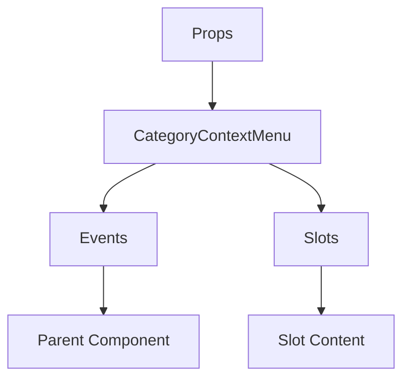

# CategoryContextMenu

A Vue component.

**File:** `src/components/CategoryContextMenu.vue`

## Overview



## Props

| Name | Type | Default | Required | Description |
|------|------|---------|----------|-------------|
| `isVisible` | `boolean` | `undefined` | ✅ | No description |
| `position` | `{ x: number; y: number }` | `undefined` | ✅ | No description |
| `category` | `union` | `undefined` | ✅ | No description |

### Props Details

#### `isVisible`

No description available.

- **Type:** `boolean`
- **Required:** Yes
- **Default:** `undefined`


#### `position`

No description available.

- **Type:** `{ x: number; y: number }`
- **Required:** Yes
- **Default:** `undefined`


#### `category`

No description available.

- **Type:** `union`
- **Required:** Yes
- **Default:** `undefined`


## Events

| Name | Parameters | Description |
|------|------------|-------------|
| `close` | `unknown` | No description |
| `create-channel` | `Category` | No description |
| `edit-category` | `Category` | No description |
| `delete-category` | `Category` | No description |

### Event Details

#### `close`

No description available.

**Parameters:** `unknown`


#### `create-channel`

No description available.

**Parameters:** `Category`


#### `edit-category`

No description available.

**Parameters:** `Category`


#### `delete-category`

No description available.

**Parameters:** `Category`


## Slots

This component has no slots.

## Methods

This component exposes no public methods.

## Usage Example

```vue
<template>
  <CategoryContextMenu
    :isVisible="true"
    :position="undefined"
    :category="undefined"
    @close="handleClose"
    @create-channel="handleCreateChannel"
    @edit-category="handleEditCategory"
    @delete-category="handleDeleteCategory" />
</template>

<script setup lang="ts">
const handleClose = (data: unknown) => {
  // Handle close event
}

const handleCreateChannel = (data: Category) => {
  // Handle create-channel event
}

const handleEditCategory = (data: Category) => {
  // Handle edit-category event
}

const handleDeleteCategory = (data: Category) => {
  // Handle delete-category event
}
</script>
```


## File Location

`src/components/CategoryContextMenu.vue`

---

*This documentation was automatically generated from the component source code.*