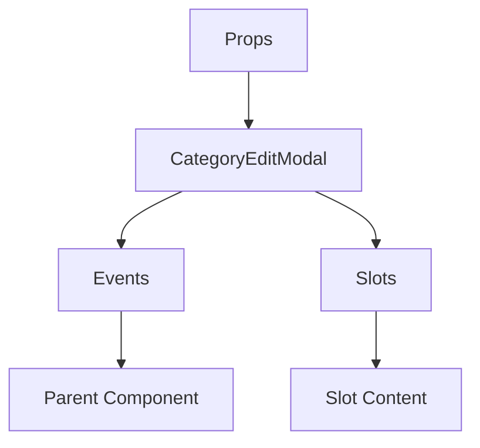

# CategoryEditModal

A Vue component.

**File:** `src/components/CategoryEditModal.vue`

## Overview



## Props

| Name | Type | Default | Required | Description |
|------|------|---------|----------|-------------|
| `show` | `boolean` | `undefined` | ✅ | No description |
| `category` | `union` | `undefined` | ✅ | No description |

### Props Details

#### `show`

No description available.

- **Type:** `boolean`
- **Required:** Yes
- **Default:** `undefined`


#### `category`

No description available.

- **Type:** `union`
- **Required:** Yes
- **Default:** `undefined`


## Events

| Name | Parameters | Description |
|------|------------|-------------|
| `close` | `unknown` | No description |
| `updated` | `Category` | No description |

### Event Details

#### `close`

No description available.

**Parameters:** `unknown`


#### `updated`

No description available.

**Parameters:** `Category`


## Slots

This component has no slots.

## Methods

This component exposes no public methods.

## Usage Example

```vue
<template>
  <CategoryEditModal
    :show="true"
    :category="undefined"
    @close="handleClose"
    @updated="handleUpdated" />
</template>

<script setup lang="ts">
const handleClose = (data: unknown) => {
  // Handle close event
}

const handleUpdated = (data: Category) => {
  // Handle updated event
}
</script>
```


## File Location

`src/components/CategoryEditModal.vue`

---

*This documentation was automatically generated from the component source code.*