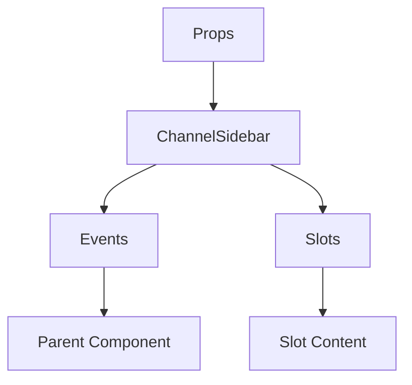

# ChannelSidebar

A Vue component.

**File:** `src/components/ChannelSidebar.vue`

## Overview



## Props

| Name | Type | Default | Required | Description |
|------|------|---------|----------|-------------|
| `currentServer` | `object` | `undefined` | ✅ | No description |
| `channels` | `Channel[]` | `undefined` | ✅ | No description |
| `categories` | `Category[]` | `undefined` | ❌ | No description |
| `categoryChannels` | `{ [key: string]: Channel[] }` | `undefined` | ✅ | No description |
| `currentChannelId` | `string` | `undefined` | ✅ | No description |

### Props Details

#### `currentServer`

No description available.

- **Type:** `object`
- **Required:** Yes
- **Default:** `undefined`


#### `channels`

No description available.

- **Type:** `Channel[]`
- **Required:** Yes
- **Default:** `undefined`


#### `categories`

No description available.

- **Type:** `Category[]`
- **Required:** No
- **Default:** `undefined`


#### `categoryChannels`

No description available.

- **Type:** `{ [key: string]: Channel[] }`
- **Required:** Yes
- **Default:** `undefined`


#### `currentChannelId`

No description available.

- **Type:** `string`
- **Required:** Yes
- **Default:** `undefined`


## Events

| Name | Parameters | Description |
|------|------------|-------------|
| `createChannel` | `string` | No description |
| `openThread` | `ThreadWithDetails` | No description |

### Event Details

#### `createChannel`

No description available.

**Parameters:** `string`


#### `openThread`

No description available.

**Parameters:** `ThreadWithDetails`


## Slots

This component has no slots.

## Methods

This component exposes no public methods.

## Usage Example

```vue
<template>
  <ChannelSidebar
    :currentServer="{}"
    :channels="undefined"
    :categoryChannels="undefined"
    :currentChannelId=""example""
    @createChannel="handleCreateChannel"
    @openThread="handleOpenThread" />
</template>

<script setup lang="ts">
const handleCreateChannel = (data: string) => {
  // Handle createChannel event
}

const handleOpenThread = (data: ThreadWithDetails) => {
  // Handle openThread event
}
</script>
```


## File Location

`src/components/ChannelSidebar.vue`

---

*This documentation was automatically generated from the component source code.*