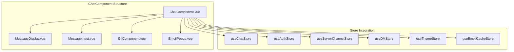
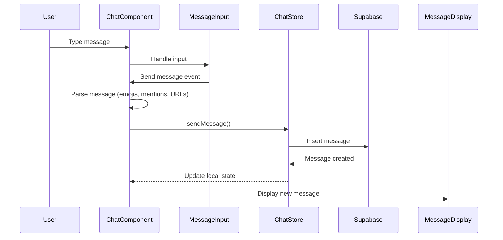
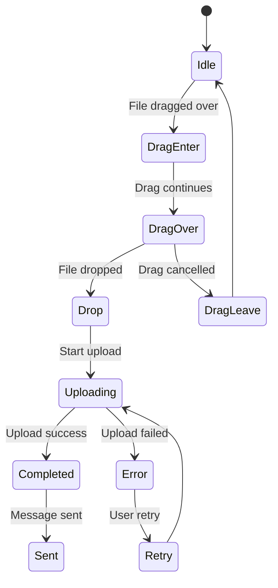

# ChatComponent

The `ChatComponent` is the core component that handles all chat functionality in Harmony, including message display, input, reactions, and file uploads.

## Overview



`ChatComponent.vue` is the central component that manages the entire chat experience. It handles:
- Message display and infinite scrolling
- Message composition and sending
- File drag-and-drop uploads
- Emoji reactions and GIF sending
- Message replies and threading

## Message Flow



## Message Parsing System

The component intelligently parses message content to handle:

- **Emojis**: Custom server emojis using `:emoji_name:` syntax
- **Mentions**: User mentions with `@username` or `@username@domain` format
- **URLs**: Automatic URL detection and preview generation
- **Files**: File attachments with upload progress tracking

```mermaid
graph LR
    INPUT[Raw Message Input] --> PARSER[Message Parser]
    PARSER --> EMOJI[Emoji Detection]
    PARSER --> MENTION[Mention Detection]
    PARSER --> URL[URL Detection]
    PARSER --> FILE[File Attachments]
    
    EMOJI --> PARTS[MessagePart[]]
    MENTION --> PARTS
    URL --> PARTS
    FILE --> PARTS
    
    PARTS --> SEND[Send to Store]
```

## File Upload Flow



## Props

```typescript
interface Props {
  messages: Message[];          // Array of messages to display
  isLoading?: boolean;         // Loading state for message fetching
  loadMoreMessages?: () => void; // Callback for loading older messages
  isDM?: boolean;              // Whether this is a direct message chat
}
```

## Emits

```typescript
interface Emits {
  (e: 'sendMessage', content: MessagePart[], replyTo?: string): void;
  (e: 'loadMoreMessages'): void;
}
```

## Features

### Message Display
- Renders messages using `MessageDisplay` component
- Supports infinite scrolling for loading older messages
- Handles message reactions and replies

### Message Input
- Uses `MessageInput` component for composition
- Supports rich text, files, emojis, and GIFs
- Real-time typing indicators

### File Upload
- Drag-and-drop file upload support
- Visual drop zone with upload progress
- Multiple file type support

### Emoji & GIF Integration
- Emoji picker with usage tracking
- GIF search and insertion via Giphy
- Reaction system for messages

## Usage

### Basic Chat
```vue
<template>
  <ChatComponent
    :messages="chatMessages"
    :is-loading="isLoadingMessages"
    @send-message="handleSendMessage"
    @load-more-messages="loadOlderMessages"
  />
</template>

<script setup lang="ts">
import { ref } from 'vue'
import ChatComponent from '@/components/ChatComponent.vue'

const chatMessages = ref([])
const isLoadingMessages = ref(false)

const handleSendMessage = (content: MessagePart[], replyTo?: string) => {
  // Handle message sending logic
}

const loadOlderMessages = () => {
  // Load pagination logic
}
</script>
```

### Direct Message Chat
```vue
<template>
  <ChatComponent
    :messages="dmMessages"
    :is-dm="true"
    @send-message="handleDMSend"
  />
</template>
```

## Dependencies

### Components
- `MessageDisplay` - Renders message list
- `MessageInput` - Message composition
- `GifComponent` - GIF search and selection
- `EmojiPopup` - Emoji picker interface

### Stores
- `useAuthStore` - User authentication state
- `useChatStore` - Chat message management
- `useServerChannelStore` - Server/channel context
- `useDMStore` - Direct message handling
- `useThemeStore` - Theme configuration
- `useEmojiCacheStore` - Emoji caching

### Services
- `userDataService` - User data operations
- `emojiService` - Emoji usage tracking

## State Management

The component manages several reactive states:

```typescript
const messageContent = ref('')           // Current message being typed
const replyToMessageId = ref<string>()   // Message being replied to
const giphyOpen = ref(false)            // GIF picker visibility
const emojiListOpen = ref(false)        // Emoji picker visibility
const showDragDropArea = ref(false)     // File drop zone visibility
const uploading = ref(false)            // File upload status
```

## Event Handling

### Drag and Drop
```typescript
const handleDragEnter = (event: DragEvent) => {
  showDragDropArea.value = true
}

const handleDrop = (event: DragEvent) => {
  const files = event.dataTransfer?.files
  if (files) {
    handleFileUpload(files)
  }
}
```

### Message Actions
```typescript
const handleSendMessage = (content: MessagePart[], replyTo?: string) => {
  emit('sendMessage', content, replyTo)
  messageContent.value = ''
  replyToMessageId.value = undefined
}

const toggleReaction = (messageId: string, emoji: Emoji) => {
  // Handle emoji reaction toggle
}
```

## Styling

The component uses scoped CSS with support for theming:

```vue
<style scoped>
.chat-container {
  display: flex;
  flex-direction: column;
  height: 100%;
  position: relative;
}

.drag-drop-area {
  position: absolute;
  top: 0;
  left: 0;
  right: 0;
  bottom: 0;
  background: rgba(0, 0, 0, 0.8);
  display: flex;
  align-items: center;
  justify-content: center;
  z-index: 1000;
}
</style>
```

## Integration Points

### With Message Display
- Passes message array and loading state
- Handles scroll-to-load-more functionality
- Manages emoji reaction events

### With Message Input
- Receives composed message content
- Handles reply state management
- Coordinates emoji/GIF picker state

### With File Upload
- Processes dropped files through Tauri API
- Shows upload progress and status
- Integrates with message content

## Performance Considerations

- Uses `v-if` for conditional rendering of heavy components (GIF/Emoji pickers)
- Implements lazy loading for message history
- Efficiently manages reactive state updates
- Optimizes file upload handling

## Accessibility

- Proper ARIA labels for interactive elements
- Keyboard navigation support
- Screen reader compatibility
- Focus management for modals and popups

## Testing

The component can be tested by mocking its dependencies:

```typescript
import { mount } from '@vue/test-utils'
import ChatComponent from '@/components/ChatComponent.vue'

const wrapper = mount(ChatComponent, {
  props: {
    messages: mockMessages,
    isLoading: false
  },
  global: {
    plugins: [createTestingPinia()]
  }
})
```

## Related Components

- [MessageDisplay](/components/messagedisplay) - Message list rendering
- [MessageInput](/components/messageinput) - Message composition
- [GifComponent](/components/gifcomponent) - GIF selection
- [EmojiPopup](/components/emojipopup) - Emoji picker
